# Algorithms and Theory

On this section, the candidate will have to show an understanding of how algorithms compare with one another and how to measure their efficacy and accuracy in the right way.

#### 1. What Are the Different Types of Machine Learning and some example of algorithms and use cases?
There are three types of machine learning:

**Supervised Learning**
- In supervised machine learning, a model makes predictions or decisions based on past or `labeled data`. Labeled data refers to sets of data that are given tags or labels, and thus made more meaningful.
- Here the human experts acts as the teacher where we feed the computer with training data containing the input/predictors and we show it the correct answers (output) and from the data the computer should be able to learn the patterns.
- Supervised learning algorithms try to *model relationships and dependencies between the target prediction output and the input features* such that we can predict the output values for new data based on those relationships which it learned from the previous data sets.
- List of Common algorithms:
 - Nearest Neighbor
 - Naive Bayes
 - Decision Trees
 - Linear Regression
 - Support Vector Machines (SVM)
 - Neural Networks

 Example of supervised learning tasks:
 - image classification
 - facial recognition
 - sales forecasting
 - customer churn prediction
  - spam detection.

**Unsupervised Learning**
- In unsupervised learning, we `don't have labeled data`. A model can identify patterns, anomalies, and relationships in the input data
- Here there’s no teacher at all, actually the computer might be able to teach you new things after it learns patterns in data, these algorithms a particularly useful in cases where the human expert doesn’t know what to look for in the data.
- are the family of machine learning algorithms which are mainly used in *pattern detection* and *descriptive modeling*. However, *there are no output categories or labels* here based on which the algorithm can try to model relationships. These algorithms try to use techniques on the input data to mine for rules, detect patterns, and summarize and group the data points which help in deriving meaningful insights and describe the data better to the users.
- List of Common algorithms:
 - k-means clustering
 - Association Rules

Examples of unsupervised learning tasks:
- customer segmentation
- anomaly detection in network traffic
- content recommendation

 **Semi-supervised Learning**
 Supervised learning uses data that is completely labeled, whereas unsupervised learning uses no training data.

 In the case of semi-supervised learning, the training data contains a small amount of labeled data and a large amount of unlabeled data. You want to train your model without labeling every single training example, for which you’ll get help from unsupervised machine learning techniques.

Some background: Machine learning has proven to be very efficient at classifying images and other unstructured data, a task that is very difficult to handle with classic rule-based software. But before machine learning models can perform classification tasks, they need to be trained on a lot of annotated examples. Data annotation is a slow and manual process that requires humans reviewing training examples one by one and giving them their right label.

In fact, data annotation is such a vital part of machine learning that the growing popularity of the technology has given rise to a huge market for labeled data. From Amazon’s Mechanical Turk to startups such as LabelBox, ScaleAI, and Samasource, there are dozens of platforms and companies whose job is to annotate data to train machine learning systems.

Fortunately, for some classification tasks, you don’t need to label all your training examples. Instead, you can use semi-supervised learning, a machine learning technique that can automate the data-labeling process with a bit of help.

One way to do semi-supervised learning is to combine clustering and classification algorithms. Clustering algorithms are unsupervised machine learning techniques that group data together based on their similarities. The clustering model will help us find the most relevant samples in our data set. We can then label those and use them to train our supervised machine learning model for the classification task.

Example:
Say we want to train a machine learning model to classify handwritten digits, but all we have is a large data set of unlabeled images of digits. Annotating every example is out of the question and we want to use semi-supervised learning to create your AI model.

First, we use k-means clustering to group our samples. K-means is a fast and efficient unsupervised learning algorithm, which means it doesn’t require any labels. K-means calculates the similarity between our samples by measuring the distance between their features. In the case of our handwritten digits, every pixel will be considered a feature, so a 20×20-pixel image will be composed of 400 features.


When training the k-means model, you must specify how many clusters you want to divide your data into. Naturally, since we’re dealing with digits, our first impulse might be to choose ten clusters for our model. But bear in mind that some digits can be drawn in different ways. For instance, here are different ways you can draw the digits 4, 7, and 2. You can also think of various ways to draw 1, 3, and 9.

Therefore, in general, the number of clusters you choose for the k-means machine learning model should be greater than the number of classes. In our case, we’ll choose 50 clusters, which should be enough to cover different ways digits are drawn.

After training the k-means model, our data will be divided into 50 clusters. Each cluster in a k-means model has a centroid, a set of values that represent the average of all features in that cluster. We choose the most representative image in each cluster, which happens to be the one closest to the centroid. This leaves us with 50 images of handwritten digits.

Now, we can label these 50 images and use them to train our second machine learning model, the classifier, which can be a logistic regression model, an artificial neural network, a support vector machine, a decision tree, or any other kind of supervised learning engine.

Training a machine learning model on 50 examples instead of thousands of images might sound like a terrible idea. But since the k-means model chose the 50 images that were most representative of the distributions of our training data set, the result of the machine learning model will be remarkable. In fact, the above example, which was adapted from the excellent book Hands-on Machine Learning with Scikit-Learn, Keras, and Tensorflow, shows that training a regression model on only 50 samples selected by the clustering algorithm results in a 92-percent accuracy (you can find the implementation in Python in this Jupyter Notebook). In contrast, training the model on 50 randomly selected samples results in 80-85-percent accuracy.


**Reinforcement Learning**
- Using reinforcement learning, the model can learn based on the rewards it received for its previous action.
- method aims at using observations gathered from the interaction with the environment to take actions that would maximize the reward or minimize the risk. Reinforcement learning algorithm (called the agent) continuously learns from the environment in an iterative fashion. In the process, the agent learns from its experiences of the environment until it explores the full range of possible states.
- Reinforcement Learning is a type of Machine Learning, and thereby also a branch of Artificial Intelligence. It allows machines and software agents to automatically determine the ideal behavior within a specific context, in order to maximize its performance. Simple reward feedback is required for the agent to learn its behavior; this is known as the reinforcement signal.
- List of Common Algorithms
 - Q-Learning
 - Temporal Difference (TD)
 - Deep Adversarial Networks


#### 2. How do you handle missing or corrupted data?
Handling the missing values is one of the greatest challenges faced by analysts, because making the right decision on how to handle it generates robust data models. Let us look at different ways of **imputing** the missing values.
- **1. Deleting Rows**: This method commonly used to handle the null values. Here, we either delete a particular row if it has a null value for a particular feature and a particular column if it has more than 70-75% of missing values. This method is advised only when there are enough samples in the data set. One has to make sure that after we have deleted the data, there is no addition of bias. Removing the data will lead to loss of information which will not give the expected results while predicting the output.
 - There are two useful methods in Pandas: `IsNull()` and `dropna()` will help to find the columns/rows with missing data and drop them
 - **Pros:**
 - Complete removal of data with missing values results in robust and highly accurate model
 - Deleting a particular row or a column with no specific information is better, since it does not have a high weightage
 - **Cons:**
 - Loss of information and data
 - Works poorly if the percentage of missing values is high (say 30%), compared to the whole dataset


- **2. Replacing With Mean/Median/Mode**: This strategy can be applied on a feature which has `numeric` data like the age of a person or the ticket fare. We can calculate the mean, median or mode of the feature and replace it with the missing values. This is an approximation which can add variance to the data set. But the loss of the data can be negated by this method which yields better results compared to removal of rows and columns. Replacing with the above three approximations are a statistical approach of handling the missing values. This method is also called as leaking the data while training. Another way is to approximate it with the deviation of neighbouring values. This works better if the data is linear.  
 - you can use `mean()` and `replace()`:
 
  - Or you can also use: `median()` or `mode()`
 
 - To replace it with median and mode we can use the following to calculate the same:
 - **Pros:**
 - This is a better approach when the data size is small
 - It can prevent data loss which results in removal of the rows and columns
 - **Cons:**
 - Imputing the approximations add variance and bias
 - Works poorly compared to other multiple-imputations method


 - **3. Assigning An Unique Category**:
A `categorical` feature will have a definite number of possibilities, such as gender, for example. Since they have a definite number of classes, we can assign another class for the missing values. Here, the features Cabin and Embarked have missing values which can be replaced with a new category, say, U for ‘unknown’. This strategy will add more information into the dataset which will result in the change of variance. Since they are categorical, we need to find one hot encoding to convert it to a numeric form for the algorithm to understand it.
 - You can use `fillna()` to fill in all `NaN` values with a value:
 
 - **Pros**:
 - Less possibilities with one extra category, resulting in low variance after one hot encoding — since it is categorical
 - Negates the loss of data by adding an unique category
 - **Cons**:
 - Adds less variance
 - Adds another feature to the model while encoding, which may result in poor performance

 - **4. Predicting The Missing Values**: Using the features which do not have missing values, we can `predict the nulls with the help of a machine learning algorithm`. This method may result in better accuracy, unless a missing value is expected to have a very high variance. We will be using linear regression to replace the nulls in the feature ‘age’, using other available features. One can experiment with different algorithms and check which gives the best accuracy instead of sticking to a single algorithm.
 
 - **Pros**:
 - Imputing the missing variable is an improvement as long as the bias from the same is smaller than the omitted variable bias
 - Yields unbiased estimates of the model parameters
 - **Cons**:
 - Bias also arises when an incomplete conditioning set is used for a categorical variable
 - Considered only as a proxy for the true values

-  **5. Using Algorithms Which Support Missing Values**
- `KNN` is a machine learning algorithm which works on the principle of distance measure. This algorithm can be used when there are nulls present in the dataset. While the algorithm is applied, KNN considers the missing values by taking the majority of the K nearest values. In this particular dataset, taking into account the person’s age, sex, class etc, we will assume that people having same data for the above mentioned features will have the same kind of fare.
 - Unfortunately, the SciKit Learn library for the K – Nearest Neighbour algorithm in Python does not support the presence of the missing values.
- Another algorithm which can be used here is `RandomForest`. This model produces a robust result because it works well on non-linear and the categorical data. It adapts to the data structure taking into consideration of the high variance or the bias, producing better results on large datasets.
- **Pros**:
- Does not require creation of a predictive model for each attribute with missing data in the dataset
- Correlation of the data is neglected
- **Cons**:
- Is a very time consuming process and it can be critical in data mining where large databases are being extracted
- Choice of distance functions can be Euclidean, Manhattan etc. which is do not yield a robust result


#### 3. What’s the trade-off between bias and variance?
*Notes to remember*: `V`ariance has a V for o`v`erfitting. Bias does not

- **Bias** is error due to erroneous or overly simplistic assumptions in the learning algorithm you’re using. This can lead to the model **underfitting** your data, making it **hard for it to have high predictive accuracy and for you to generalize** your knowledge from the training set to the test set.

- **Variance** is error due to too much complexity in the learning algorithm you’re using. This leads to the algorithm being highly sensitive to high degrees of variation in your training data, which can lead your model to **overfit** the data. You’ll be **carrying too much noise from your training data** for your model to be very useful for your test data.

The bias-variance decomposition essentially decomposes the learning error from any algorithm by adding the bias, the variance and a bit of irreducible error due to noise in the underlying dataset. Essentially, if you make the model more complex and add more variables, you’ll lose bias but gain some variance — in order to get the optimally reduced amount of error, you’ll have to tradeoff bias and variance.
**You don’t want either high bias or high variance in your model.**


#### 4. Confusion matrix
##### 4a. What is a Confusion matrix?

- It is a tool to determine the performance of a classifier. It contains information about actual and predicted classifications. The below table shows confusion matrix of two-class, spam and non-spam classifier.
- There are four outputs in confusion matrix:
- **True Positive (TP)**: the number of correct predictions that an example is positive which means positive class correctly identified as positive.
 - Example: Given class is spam and the classifier has been correctly predicted it as spam.      
- **False Negative (FN)**: the number of incorrect predictions that an example is negative which means positive class incorrectly identified as negative.
 - Example: Given class is spam however, the classifier has been incorrectly predicted it as non-spam.  
- **False positive (FP)**: the number of incorrect predictions that an example is positive which means negative class incorrectly identified as positive.
 - Example: Given class is non-spam however, the classifier has been incorrectly predicted it as spam.
- **True Negative (TN)**: the number of correct predictions that an example is negative which means negative class correctly identified as negative.
 - Example: Given class is spam and the classifier has been correctly predicted it as negative.
 


##### 4b. In a Confusion matrix, define accuracy, precision, recall and F1 score.
- **Accuracy** could be a deceptively reasonable-sounding metric for classifiers: It is the `proportion of the correctly predicted labels among all our predictions`.
 - `accuracy = (True Positives + True Negatives) / Total Points`
 - Accuracy is not always perfect for model evaluation, especially for imbalanced data sets. For example, let's use a spam filter. Spams are annoying but relatively rare. Assuming a true spam rate of 2%, we could have a dumb filter that simply labels every email as non-spam. In doing so, the filter is correct 98% of the time, which is equivalent to an impressive accuracy score of 0.98, but this dumb filter is also clearly useless.
 - Therefore, accuracy can only be useful when the classes are well balanced and we care equally about both the positive and negative cases.

- **Recall** (also known as **sensitivity** or as the `true positive rate`): the amount of positives your model claims compared to the actual number of positives there are throughout the data.
 - The recall score is of particular interest when `minimizing false negatives` takes priority (e.g., screening for a fatal infectious disease; a false negative would send a patient home without timely treatment).
 - `recall= True Positives / (True Positives + False Negatives)`
 - Recall focuses on `False Negative` errors.


- **Precision** (also known as the `positive predictive value`) is the proportion of correctly identified positive labels (TP) among all the predicted positive labels (TP + FP).
  - Precision focuses on `False Positive` errors.
  - Because low FP yields high precision, precision is an excellent metric when `minimizing false-positives takes priority` (e.g., a `spam filter` misidentifies legitimate emails as spam). However, when the positive cases are rare, precision alone is not enough to warn us against the case of high false negatives.!
 - `precision= True Positives / (True Positives + False Positives)`


- **F1 score**: weighted average of the recall (sensitivity) and precision. F1 score might be good choice when you seek to balance between Precision and Recall.


- **specificity**: is the mirror image of recall (also known as sensitivity): It tells us the proportion of correctly identified negative labels (TN)among all the negative labels (TN + FP)


##### 4c. Explain how a ROC curve works.
The ROC curve is a graphical representation of the contrast between true positive rates and the false positive rate at various thresholds. It’s often used as a proxy for the trade-off between the sensitivity of the model (true positives) vs the fall-out or the probability it will trigger a false alarm (false positives).


#### 5. What is Bayes’ Theorem? How is it useful in a machine learning context?
- Bayes’ Theorem gives you the posterior probability of an event given what is known as prior knowledge.
- Formula: `P(A∣B)= P(A)*P(B∣A) / P(B)`

- Mathematically, it’s expressed as the true positive rate of a condition sample divided by the sum of the false positive rate of the population and the true positive rate of a condition.
 - Example: Say you had a 60% chance of actually having the flu after a flu test, but out of people who had the flu, the test will be false 50% of the time, and the overall population only has a 5% chance of having the flu. Would you actually have a 60% chance of having the flu after having a positive test?
 - Bayes’ Theorem says no. It says that you have a (.6 * 0.05) (True Positive Rate of a Condition Sample) / (.6 * 0.05)(True Positive Rate of a Condition Sample) + (.5 * 0.95) (False Positive Rate of a Population)  = 0.0594 or 5.94% chance of getting a flu.
- Bayes’ Theorem is the basis behind a branch of machine learning that most notably includes the Naive Bayes classifier.


##### 5b. What Is ‘naive’ in the Naive Bayes Classifier?
 - The classifier is called ‘naive’ because it makes assumptions that may or may not turn out to be correct.
 - The algorithm assumes that the presence of one feature of a class is not related to the presence of any other feature (**absolute independence of features**), given the class variable.
 - For instance, a **fruit may be considered to be a cherry if it is red in color and round in shape, regardless of other features**. This assumption may or may not be right (as an apple also matches the description).


#### 6. What’s your favorite algorithm, and can you explain it to me in less than a minute?
 - Interviewers ask such machine learning interview questions to test your understanding of how to communicate complex and technical nuances with poise and the ability to summarize quickly and efficiently. While answering such questions, make sure you have a choice and ensure you can explain different algorithms so simply and effectively that a five-year-old could grasp the basics!


#### 7. What’s the difference between Type I and Type II error?
 - Don’t think that this is a trick question! Many machine learning interview questions will be an attempt to lob basic questions at you just to make sure you’re on top of your game and you’ve prepared all of your bases.
 - **Type I** error is a `false positive`
 - **Type II** error is a `false negative`.
  - Briefly stated, Type I error means claiming something has happened when it hasn’t, while Type II error means that you claim nothing is happening when in fact something is.
 - A clever way to think about this is to think of:
  - `Type I` error as telling a man he is pregnant
  - while `Type II` error means you tell a pregnant woman she isn’t carrying a baby.


#### 8. What Are the Three Stages of Building a Model in Machine Learning?
The three stages of building a machine learning model are:
 - Model Building: Choose a suitable algorithm for the model and train it according to the requirement
- Model Testing: Check the accuracy of the model through the test data
- Applying the Model: Make the required changes after testing and use the final model for real-time projects
Here, it’s important to remember that once in a while, the model needs to be checked to make sure it’s working correctly. It should be modified to make sure that it is up-to-date.


#### 9. Compare K-means and KNN Algorithms.
 - **K-Means**
  - K-Means is unsupervised
  - K-Means is a clustering algorithm
  - The points in each cluster are similar to each other, and each cluster is different from its neighboring clusters

 - **KNN**
  - KNN is supervised in nature
  - KNN is a classification algorithm
  - It classifies an unlabeled observation based on its K (can be any number) surrounding neighbors
  - KNN is a typical example of a `lazy learner`. It is called lazy not because of its apparent simplicity, but because it doesn't learn a discriminative function from the training data but memorizes the training dataset instead.


##### 9b - explain the K Nearest Neighbor algorithm
K nearest neighbor algorithm is a classification algorithm that works in a way that a new data point is assigned to a neighboring group to which it is most similar.

In K nearest neighbors, K can be an integer greater than 1. So, for every new data point, we want to classify, we compute to which neighboring group it is closest.

Let us classify an object using the following example. Consider there are three clusters:
- Football
- Basketball
- Tennis ball

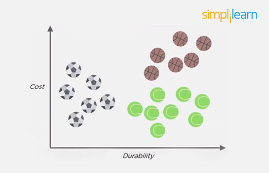
Let the new data point to be classified is a black ball. We use KNN to classify it. Assume K = 5 (initially).

Next, we find the K (five) nearest data points, as shown.

Observe that all five selected points do not belong to the same cluster. There are three tennis balls and one each of basketball and football.

When multiple classes are involved, we prefer the majority. Here the majority is with the tennis ball, so the new data point is assigned to this cluster.


#### 10. When Will You Use Classification over Regression?
- Classification is used when your target is categorical, while regression is used when your target variable is continuous. Both classification and regression belong to the category of supervised machine learning algorithms.
- Examples of classification problems include:
 - Predicting yes or no
 - Estimating gender
 - Breed of an animal
 - Type of color
- Examples of regression problems include:
 - Estimating sales and price of a product
 - Predicting the score of a team
 - Predicting the amount of rainfall

#### 11. How Do You Design an Email Spam Filter?
 - Building a spam filter involves the following process:
 - The email spam filter will be fed with thousands of emails
 - Each of these emails already has a label: ‘spam’ or ‘not spam.’
 - The supervised machine learning algorithm will then determine which type of emails are being marked as spam based on spam words like the lottery, free offer, no money, full refund, etc.
 - The next time an email is about to hit your inbox, the spam filter will use statistical analysis and algorithms like Decision Trees and SVM to determine how likely the email is spam
 - If the likelihood is high, it will label it as spam, and the email won’t hit your inbox
 - Based on the accuracy of each model, we will use the algorithm with the highest accuracy after testing all the models


#### 12. What is a Random Forest?
- A ‘random forest’ is a supervised machine learning algorithm that is generally used for classification problems. It operates by constructing multiple decision trees during the training phase. The random forest chooses the decision of the majority of the trees as the final decision.


#### 13. What is XGboost?
**XGBoost** is an algorithm that has recently been dominating applied machine learning and Kaggle competitions for structured or tabular data.

XGBoost stands for e`X`treme `G`radient `Boost`ing.
It is a popular and efficient open-source implementation of the gradient boosted trees algorithm. Gradient boosting is a supervised learning algorithm that attempts to accurately predict a target variable by **combining an ensemble of estimates from a set of simpler and weaker models**. The XGBoost algorithm performs well in machine learning competitions because of its robust handling of a variety of data types, relationships, distributions, and the variety of hyperparameters that you can fine-tune. You can use XGBoost for regression, classification (binary and multiclass), and ranking problems.

- Model Features
The implementation of the model supports the features of the scikit-learn and R implementations, with new additions like regularization. Three main forms of gradient boosting are supported:

  - Gradient Boosting algorithm also called gradient boosting machine including the learning rate.
  - Stochastic Gradient Boosting with sub-sampling at the row, column and column per split levels.
  - Regularized Gradient Boosting with both L1 and L2 regularization.


 - System Features
The library provides a system for use in a range of computing environments, not least:

  - Parallelization of tree construction using all of your CPU cores during training.
  - Distributed Computing for training very large models using a cluster of machines.
  - Out-of-Core Computing for very large datasets that don’t fit into memory.
  - Cache Optimization of data structures and algorithm to make best use of hardware.

 - Algorithm Features
The implementation of the algorithm was engineered for efficiency of compute time and memory resources. A design goal was to make the best use of available resources to train the model. Some key algorithm implementation features include:

  - Sparse Aware implementation with automatic handling of missing data values.
  - Block Structure to support the parallelization of tree construction.
  - Continued Training so that you can further boost an already fitted model on new data.
XGBoost is free open source software available for use under the permissive Apache-2 license.

- Why Use XGBoost?
The two reasons to use XGBoost are also the two goals of the project:

  - Execution Speed.
  - Model Performance.

XGBoost is a decision-tree-based ensemble Machine Learning algorithm that uses a gradient boosting framework. In prediction problems involving unstructured data (images, text, etc.) artificial neural networks tend to outperform all other algorithms or frameworks. tree-basedHowever, when it comes to small-to-medium structured/tabular data, decision tree based algorithms are considered best-in-class right now. Please see the chart below for the evolution of tree-based algorithms over the years.

Note - Ensemble learning methods can be performed in two ways:
- **Bagging** (parallel ensemble)
- **Boosting** (sequential ensemble)


##### Working of boosting algorithm:
The boosting algorithm **creates new weak learners (models) and sequentially combines their predictions** to improve the overall performance of the model.

For any incorrect prediction, **larger weights are assigned to misclassified samples** and lower ones to samples that are correctly classified. Weak learner models that perform better have higher weights in the final ensemble model.

**Boosting never changes the previous predictor and only corrects the next predictor by learning from mistakes**.

**Since Boosting is greedy, it is recommended to set a stopping criterion such as model performance (early stopping) or several stages (e.g. depth of tree in tree-based learners) to prevent overfitting of training data**.

The first implementation of boosting was named **AdaBoost (Adaptive Boosting).**
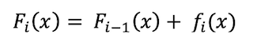

`Capital F(i) is current model, F(i-1) is previous model and small f(i) represents a weak model`

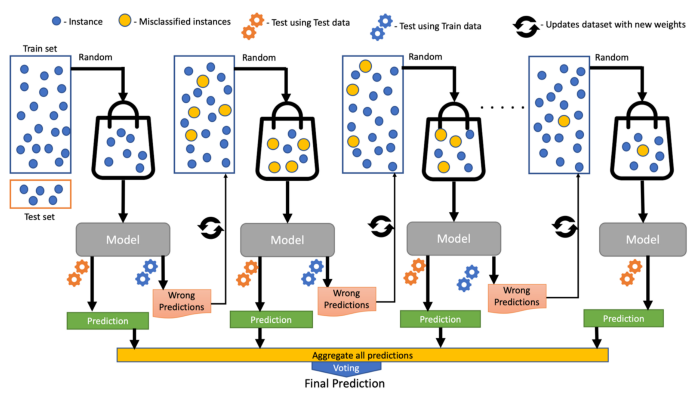


**Gradient boosting** uses Additive Modeling in which a new decision tree is added one at a time to a model that minimizes the loss using gradient descent.  
- Existing trees in the model remain untouched and thus slow down the rate of overfitting.
- The output of the new tree is combined with the output of existing trees until the loss is minimized below a threshold or specified limit of trees is reached.

#### 13b Decision Tree and Random Forest
##### What is A Decision Tree Algorithm?
Decision tree learning is a common type of machine learning algorithm. One of the advantages of the decision trees over other machine learning algorithms is **how easy they make it to visualize data**. At the same time, they offer significant versatility: they **can be used for building both classification and regression predictive models**.

Decision tree algorithms work by constructing a “tree.” In this case, based on an Italian wine dataset, the tree is being used to classify different wines based on alcohol content (e.g., greater or less than 12.9%) and degree of dilution (e.g., an OD280/OD315 value greater or less than 2.1). Each branch (i.e., the vertical lines in figure 1 below) corresponds to a feature, and each leaf represents a target variable. In our case, the features are Alcohol and OD280/OD315, and the target variables are the Class of each observation (0,1 or 2).

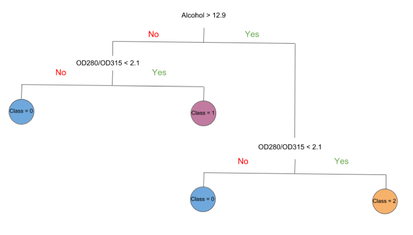

 Without any fine tuning of the algorithm, decision trees produce moderately successful results. Coupled with ensemble methods that data scientists have developed, like boosting and bagging, they can achieve surprisingly high predictability.

The forest is said to robust when there are a lot of trees in the forest. Random Forest is an ensemble technique that is a tree-based algorithm. The process of fitting no decision trees on different subsample and then taking out the average to increase the performance of the model is called “Random Forest”.

sSuppose we have to go on a vacation to someplace. Before going to the destination we vote for the place where we want to go. Once we have voted for the destination then we choose hotels, etc. And then come back with the final choice of hotel as well. The whole process of getting the vote for the place to the hotel is nothing but a Random Forest Algorithm. This is the way the algorithm works and the reason it is preferred over all other algorithms because of its ability to give high accuracy and to prevent overfitting by making use of more trees.

There are several different hyperparameters like no trees, depth of trees, jobs, etc in this algorithm. Check here the Sci-kit documentation for the same.


##### A Simple Analogy to Explain Decision Tree vs. Random Forest
Let’s start with a thought experiment that will illustrate the difference between a decision tree and a random forest model.

- Suppose a bank has to approve a small loan amount for a customer and the bank needs to make a decision quickly. The bank checks the person’s credit history and their financial condition and finds that they haven’t re-paid the older loan yet. Hence, the bank rejects the application.
  - But here’s the catch – the loan amount was very small for the bank’s immense coffers and they could have easily approved it in a very low-risk move. Therefore, the bank lost the chance of making some money.

- Now, another loan application comes in a few days down the line but this time the bank comes up with a different strategy – **multiple decision-making processes**. Sometimes it checks for credit history first, and sometimes it checks for customer’s financial condition and loan amount first. Then, the bank combines results from these multiple decision-making processes and decides to give the loan to the customer.
  - Even if this process took more time than the previous one, the bank profited using this method. This is a classic example where **collective decision making outperformed a single decision-making process**.

###### Bank example for Decision Tree
Brief Introduction to Decision Trees
A decision tree is a supervised machine learning algorithm that can be used for both classification and regression problems. A decision tree is simply a series of sequential decisions made to reach a specific result. Here’s an illustration of a decision tree in action (using our above example):
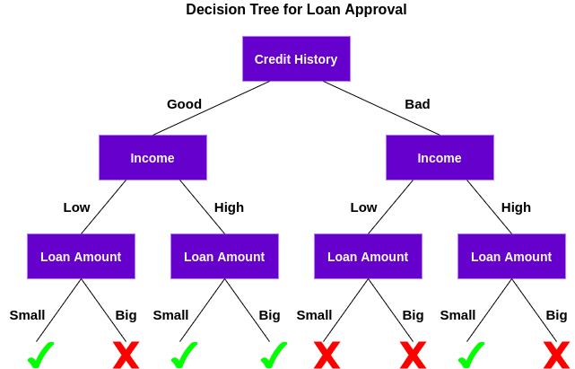

First, it checks if the customer has a good credit history. Based on that, it classifies the customer into two groups, i.e., customers with good credit history and customers with bad credit history. Then, it checks the income of the customer and again classifies him/her into two groups. Finally, it checks the loan amount requested by the customer. Based on the outcomes from checking these three features, the decision tree decides if the customer’s loan should be approved or not.

The features/attributes and conditions can change based on the data and complexity of the problem but the overall idea remains the same. So, a decision tree makes a series of decisions based on a set of features/attributes present in the data, which in this case were credit history, income, and loan amount.

###### Bank example for Random Forest
Random Forest is a tree-based machine learning algorithm that leverages the power of multiple decision trees for making decisions. As the name suggests, it is a “forest” of trees!

But why do we call it a “random” forest? That’s because it is a forest of randomly created decision trees. Each node in the decision tree works on a random subset of features to calculate the output. The random forest then combines the output of individual decision trees to generate the final output.

In simple words:
*The Random Forest Algorithm combines the output of multiple (randomly created) Decision Trees to generate the final output.*


This process of combining the output of multiple individual models (also known as weak learners) is called Ensemble Learning.

##### 13c. Ensemble learning - Random Forests vs Gradient Boosted Trees
Simply put, ensemble learning algorithms build upon other machine learning methods by combining models. The combination can be more powerful and accurate than any of the individual models.

The main difference between these two algorithms is the order in which each component tree is trained.
 - **Random Forests** train each tree independently, using a random sample of the data. This randomness helps to make the model more robust than a single decision tree, and less likely to overfit on the training data.
 - **GBTs** train one tree at a time, where each new tree helps to correct errors made by previously trained trees. With each tree added, the model becomes even more expressive.

 In the end, both methods produce a weighted collection of Decision Trees. The ensemble model makes predictions by combining results from the individual trees. The figure below shows a simple example of an ensemble with three trees.
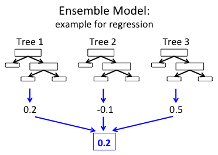

 In the example regression ensemble above, each tree predicts a real value. These three predictions are then combined to produce the ensemble’s final prediction. Here, we combine predictions using the mean (but the algorithms use different techniques depending on the prediction task).


#### 14. Explain how a ROC curve works
A Receiver Operating Characteristic curve, or **ROC** curve, is a graphical plot of the contrast between true positive rates and the false positive rate at various thresholds.

 It’s often used as a proxy for the trade-off between the sensitivity of the model (true positives) vs the fall-out or the probability it will trigger a false alarm (false positives).

 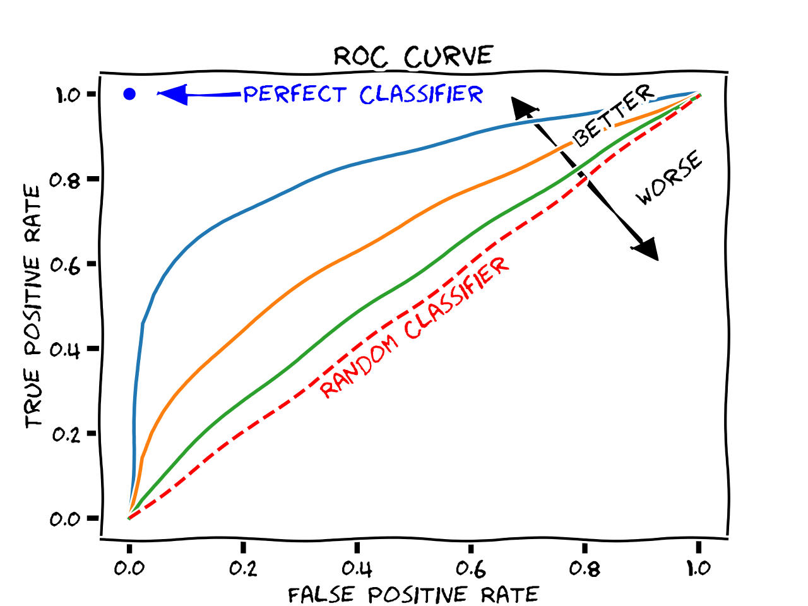


##### 14b. What is AUC ?
**AUC** stand for Area Under The Curve. AUC represents the degree or measure of separability. It tells how much the model is capable of distinguishing between classes.
Higher the AUC, the better the model is at predicting 0s as 0s and 1s as 1s. By analogy, the Higher the AUC, the better the model is at distinguishing between patients with the disease and no disease.


###### Defining terms used in AUC and ROC Curve.


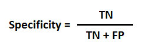

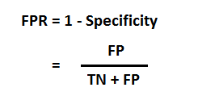

##### How to speculate about the performance of the model?
- An excellent model has AUC near to the 1 which means it has a good measure of separability.
- A poor model has AUC near to the 0 which means it has the worst measure of separability. In fact, it means it is reciprocating the result. It is predicting 0s as 1s and 1s as 0s.
- And when AUC is 0.5, it means the model has no class separation capacity whatsoever.


#### 15. What’s a Fourier transform?
A **Fourier transform** is a generic method to decompose generic functions into a superposition of symmetric functions.
- Analogy - Given a smoothie, it’s how we find the recipe.
- The Fourier transform finds the set of cycle speeds, amplitudes, and phases to match any time signal.
- A Fourier transform converts a signal from time to frequency domain—it’s a very common way to extract features from audio signals or other time series such as sensor data.
- The Fourier Transform is a tool that breaks a waveform (a function or signal) into an alternate representation, characterized by sine and cosines. The Fourier Transform shows that any waveform can be re-written as the sum of sinusoidal functions.


#### 15. What’s a Fourier transform?
The distinction between `probability` and `likelihood` is fundamentally important:
- **Probability** attaches to `possible results`.
- **Likelihood** attaches to `hypotheses`.

- Possible `results` are `mutually exclusive and exhaustive`.
 - Suppose we ask a subject to predict the outcome of each of 10 tosses of a
coin. There are only 11 possible results (0 to 10 correct predictions). The actual result will always be one and only one of the
possible results. Thus, `the probabilities that attach to the possible results must sum to 1`.
- `Hypotheses`, unlike results, are `neither mutually exclusive nor exhaustive`.
 - Suppose that the first subject we test predicts 7 of the 10
outcomes correctly. I might hypothesize that the subject just guessed, and you might hypothesize that the subject may be
somewhat clairvoyant, by which you mean that the subject may be expected to correctly predict the results at slightly greater than
chance rates over the long run. These are different hypotheses, but they are not mutually exclusive, because you hedged when you
said “may be.” You thereby allowed your hypothesis to include mine. In technical terminology, my hypothesis is nested within yours.
Someone else might hypothesize that the subject is strongly clairvoyant and that the observed result underestimates the probability
that her next prediction will be correct. Another person could hypothesize something else altogether. There is no limit to the
hypotheses one might entertain.
 - The `set of hypotheses to which we attach likelihoods is limited by our capacity to dream them up`. In practice, we can rarely be
confident that we have imagined all the possible hypotheses. Our concern is to estimate the extent to which the experimental
results affect the relative likelihood of the hypotheses we and others currently entertain. Because we generally do not entertain the
full set of alternative hypotheses and because some are nested within others, the likelihoods that we attach to our hypotheses do
not have any meaning in and of themselves; only the relative likelihoods — that is, the ratios of two likelihoods — have meaning.


#### 16. What’s the difference between a generative and discriminative model?
- A `generative model` will learn categories of data.
 - A Generative Model ‌learns the `joint probability distribution p(x,y)`. It predicts the conditional probability with the help of Bayes Theorem.
 - Examples:
  - ‌Naïve Bayes
  - Bayesian networks
  - Markov random fields
  - Hidden Markov Models (HMM)


- A `discriminative` model will simply learn the distinction between different categories of data.
Discriminative models will generally outperform generative models on classification tasks.
 -  Discriminative model ‌learns the `conditional probability distribution p(y|x)`. Both of these models were generally used in supervised learning problems.
 - Examples:
 - Logistic regression
 - Scalar Vector Machine
 - Traditional neural networks
 - Nearest neighbour
 - Conditional Random Fields (CRF)s


#### 17. What is deep learning, and how does it contrast with other machine learning algorithms?
Deep learning is a subset of machine learning that is concerned with neural networks: how to use backpropagation and certain principles from neuroscience to more accurately model large sets of unlabelled or semi-structured data. In that sense, deep learning represents an unsupervised learning algorithm that learns representations of data through the use of neural nets.

A neural network (“NN”) can be well presented in a directed acyclic graph: the input layer takes in signal vectors; one or multiple hidden layers process the outputs of the previous layer.

Here is a A three-layer artificial neural network:
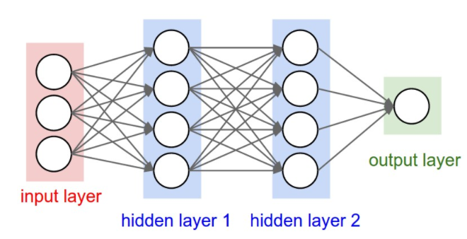

Here is an interesting plot presenting the relationship between the data scale and the model performance, proposed by Andrew Ng in his “Nuts and Bolts of Applying Deep Learning” talk.
- On a `small dataset`, `traditional algorithms` (Regression, Random Forests, SVM, GBM, etc.) or statistical learning does a great job
- Once the `data scale goes up to the sky`, the `large NN outperforms others`. Partially because compared to a traditional ML model, a neural network model has many more parameters and has the `capability to learn complicated nonlinear patterns`. Thus we expect the model to pick the most helpful features by itself without too much expert-involved manual feature engineering.

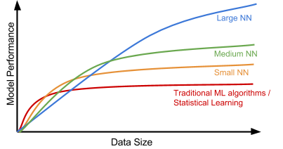


##### 17b. What are different Deep neural nets?
###### 1. Convolutional Neural Network (CNN)
A **Convolutional Neural Network**, also known as CNN or ConvNet, is a class of neural networks that specializes in processing data that has a grid-like topology, such as an image.

A digital image is a binary representation of visual data. It contains a series of pixels arranged in a grid-like fashion that contains pixel values to denote how bright and what color each pixel should be.
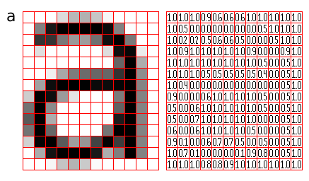

The layers are arranged in such a way so that they detect simpler patterns first (lines, curves, etc.) and more complex patterns (faces, objects, etc.) further along.

**Convolutional Neural Network Architecture**

A CNN typically has three layers:
- a convolutional layer - to extract high level features, but they are then fed into e.g. fully connected layers for classification tasks.
- a pooling layer
- a fully connected layer - for classification

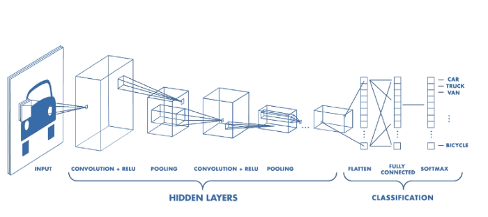

**Convolutional layer**:
they look for low-level local features (e.g. horizontal or vertical lines) in the first layers, and for more high-level feature in later layers.
It is the core building block of the CNN. It carries the main portion of the network’s computational load.
This layer performs a dot product between two matrices, where one matrix is the set of learnable parameters otherwise known as a kernel, and the other matrix is the restricted portion of the receptive field. The kernel is spatially smaller than an image but is more in-depth. This means that, if the image is composed of three (RGB) channels, the kernel height and width will be spatially small, but the depth extends up to all three channels

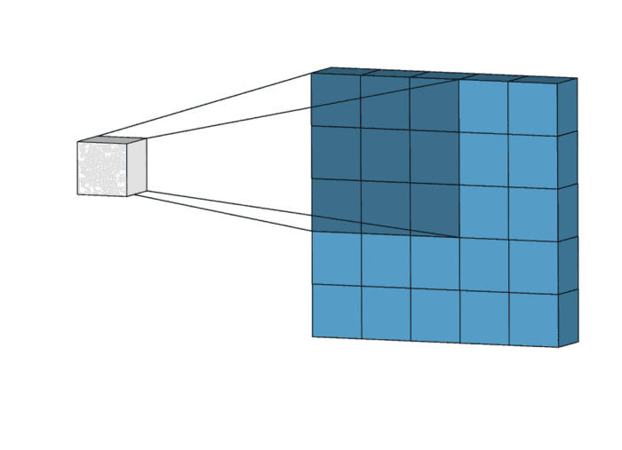

The layer consists of trainable filters or kernels which operate on the input to generate the output feature maps.


**pooling layer**:
The pooling layer replaces the output of the network at certain locations by deriving a summary statistic of the nearby outputs. This helps in reducing the spatial size of the representation, which decreases the required amount of computation and weights. The pooling operation is processed on every slice of the representation individually.

There are several pooling functions such as the average of the rectangular neighborhood, L2 norm of the rectangular neighborhood, and a weighted average based on the distance from the central pixel. However, the most popular process is max pooling, which reports the maximum output from the neighborhood.
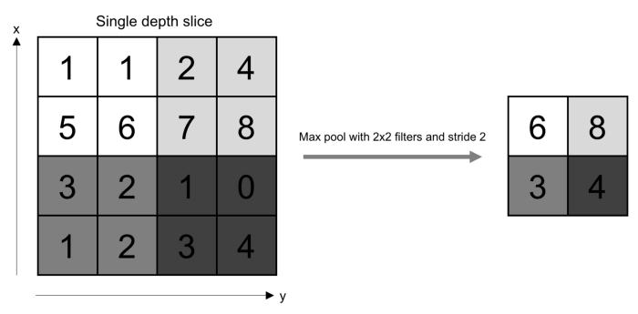

Pooling involves selecting a pooling operation, much like a filter to be applied to feature maps. The size of the pooling operation or filter is smaller than the size of the feature map; specifically, it is almost always 2×2 pixels applied with a stride of 2 pixels.

This means that the pooling layer will always reduce the size of each feature map by a factor of 2, e.g. each dimension is halved, reducing the number of pixels or values in each feature map to one quarter the size. For example, a pooling layer applied to a feature map of 6×6 (36 pixels) will result in an output pooled feature map of 3×3 (9 pixels).


**Fully Connected Layer**:
Neurons in this layer have full connectivity with all neurons in the preceding and succeeding layer as seen in regular FCNN. This is why it can be computed as usual by a matrix multiplication followed by a bias effect


###### 2. Recurrent Neural Networks (RNNs)
RNNs are networks that have cycles and therefore have “state memory”. They can be unrolled in time to become feed forward networks where the weights are shared. Just as CNNs share weights across “space”, RNNs share weights across “time”. This allows them to process and efficiently represent patterns in sequential data.

Many variants of RNNs modules have been developed, including LSTMs and GRUs, to help learn patterns in longer sequences. Applications include natural language modeling, speech recognition, speech generation, etc.


###### 3. Auto encoders
Autoencoders are one of the simpler forms of “unsupervised learning” taking the encoder-decoder architecture and learning to generate an exact copy of the input data. Since the encoded representation is much smaller than the input data, the network is forced to learn how to form the most meaningful representation.


Since the ground truth data comes from the input data, no human effort is required. In other words, it’s self-supervised. Applications include unsupervised embeddings, image denoising, etc

Hinton and Salakhutdinov used autoencoders to compress documents on a variety of topics. As shown in Fig 10, when both PCA and autoencoder were applied to reduce the documents onto two dimensions, autoencoder demonstrated a much better outcome. With the help of autoencoder, we can do efficient data compression to speed up the information retrieval including both documents and images.

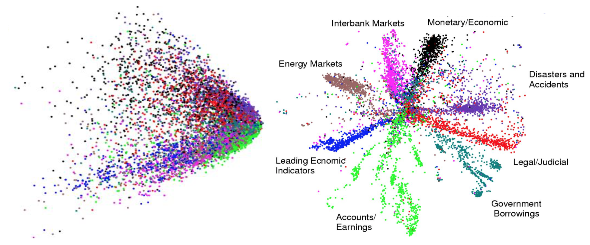


###### 4. Generative Adversarial Networks (GANs)
AN is able to create new examples after learning through the real data. It is consist of two models competing against each other in a zero-sum game framework

In the original GAN paper, GAN was proposed to generate meaningful images after learning from real photos. It comprises two independent models: the Generator and the Discriminator. The generator produces fake images and sends the output to the discriminator model. The discriminator works like a judge, as it is optimized for identifying the real photos from the fake ones. The generator model is trying hard to cheat the discriminator while the judge is trying hard not to be cheated. This interesting zero-sum game between these two models motivates both to develop their designed skills and improve their functionalities. Eventually, we take the generator model for producing new images.


###### 5. Deep Reinforcement Learning (Deep RL)
Reinforcement learning (RL) is a framework for teaching an agent how to act in the world in a way that maximizes reward. When the learning is done by a neural network, we refer to it as Deep Reinforcement Learning (Deep RL). There are three types of RL frameworks: policy-based, value-based, and model-based. The distinction is what the neural network is tasked with learning.

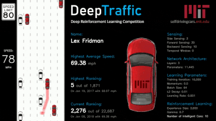


#### 18. What cross-validation technique would you use on a time series dataset?
Instead of using standard k-folds cross-validation, you have to pay attention to the fact that a time series is not randomly distributed data—it is inherently ordered by chronological order. If a pattern emerges in later time periods, for example, your model may still pick up on it even if that effect doesn’t hold in earlier years!

You’ll want to do something like `forward chaining` where you’ll be able to model on past data then look at forward-facing data.

- Fold 1 : training [1], test [2]
- Fold 2 : training [1 2], test [3]
- Fold 3 : training [1 2 3], test [4]
- Fold 4 : training [1 2 3 4], test [5]
- Fold 5 : training [1 2 3 4 5], test [6]


#### 19. How is a decision tree pruned?
Answer: Pruning is what happens in decision trees when branches that have weak predictive power are removed in order to reduce the complexity of the model and increase the predictive accuracy of a decision tree model. Pruning can happen bottom-up and top-down, with approaches such as reduced error pruning and cost complexity pruning.

Reduced error pruning is perhaps the simplest version: replace each node. If it doesn’t decrease predictive accuracy, keep it pruned. While simple, this heuristic actually comes pretty close to an approach that would optimize for maximum accuracy.


#### 20. How would you handle an imbalanced dataset?
An imbalanced dataset is when you have, for example, a classification test and 90% of the data is in one class. That leads to problems: an accuracy of 90% can be skewed if you have no predictive power on the other category of data!

Here are a few tactics to get over the hump:
- Collect more data to even the imbalances in the dataset.
- Resample the dataset to correct for imbalances.
 - Random under-sampling: Random Undersampling aims to balance class distribution by randomly eliminating majority class examples.  This is done until the majority and minority class instances are balanced out.
 - Random Over-Sampling: Over-Sampling increases the number of instances in the minority class by randomly replicating them in order to present a higher representation of the minority class in the sample
 - Synthetic Minority Over-sampling Technique (`SMOTE`) for imbalanced data. This technique is followed to avoid overfitting which occurs when exact replicas of minority instances are added to the main dataset. A subset of data is taken from the minority class as an example and then new synthetic similar instances are created. These synthetic instances are then added to the original dataset. The new dataset is used as a sample to train the classification models.
- Try a different algorithm altogether on your dataset.
- What’s important here is that you have a keen sense for what damage an unbalanced dataset can cause, and how to balance that.


#### 21. When should you use classification over regression?
Classification produces discrete values and dataset to strict categories, while regression gives you continuous results that allow you to better distinguish differences between individual points. You would use classification over regression if you wanted your results to reflect the belongingness of data points in your dataset to certain explicit categories (ex: If you wanted to know whether a name was male or female rather than just how correlated they were with male and female names.)


#### 22. How do you ensure you’re not overfitting with a model?
This is a simple restatement of a fundamental problem in machine learning: the possibility of overfitting training data and carrying the noise of that data through to the test set, thereby providing inaccurate generalizations.

There are three main methods to avoid overfitting:
- Keep the model simpler: reduce variance by taking into account fewer variables and parameters, thereby removing some of the noise in the training data.
- Use cross-validation techniques such as k-folds cross-validation.
- Use regularization techniques such as LASSO that penalize certain model parameters if they’re likely to cause overfitting.


#### 23. What evaluation approaches would you work to gauge the effectiveness of a machine learning model?
You would first split the dataset into training and test sets, or perhaps use cross-validation techniques to further segment the dataset into composite sets of training and test sets within the data. You should then implement a choice selection of performance metrics. You could use measures such as the F1 score, the accuracy, and the confusion matrix.

#### 24. What’s the “kernel trick” and how is it useful?
The Kernel trick involves kernel functions that can enable in higher-dimension spaces without explicitly calculating the coordinates of points within that dimension: instead, kernel functions compute the inner products between the images of all pairs of data in a feature space. This allows them the very useful attribute of calculating the coordinates of higher dimensions while being computationally cheaper than the explicit calculation of said coordinates. Many algorithms can be expressed in terms of inner products. Using the kernel trick enables us effectively run algorithms in a high-dimensional space with lower-dimensional data.


#### 25. How Do You Design an Email Spam Filter?
Building a spam filter involves the following process:
- The email spam filter will be fed with thousands of emails
- Each of these emails already has a label: ‘spam’ or ‘not spam.’
- The supervised machine learning algorithm will then determine which type of emails are being marked as spam based on spam words like the lottery, free offer, no money, full refund, etc.
- The next time an email is about to hit your inbox, the spam filter will use statistical analysis and algorithms like Decision Trees and SVM to determine how likely the email is spam
- If the likelihood is high, it will label it as spam, and the email won’t hit your inbox
- Based on the accuracy of each model, we will use the algorithm with the highest accuracy after testing all the models
- To note accuracy is not enough to measure the model's performance based on most likely imbalanced dataset. If that is the case, one needs to use another metric to optimize (`recall` for example)


#### 26. Considering a Long List of Machine Learning Algorithms, given a Data Set, How Do You Decide Which One to Use?
There is no master algorithm for all situations. Choosing an algorithm depends on the following questions:
- How much data do you have, and is it continuous or categorical?
- Is the problem related to classification, association, clustering, or regression?
- Predefined variables (labeled), unlabeled, or mix?
What is the goal?
- Based on the above questions, the following algorithms can be used:

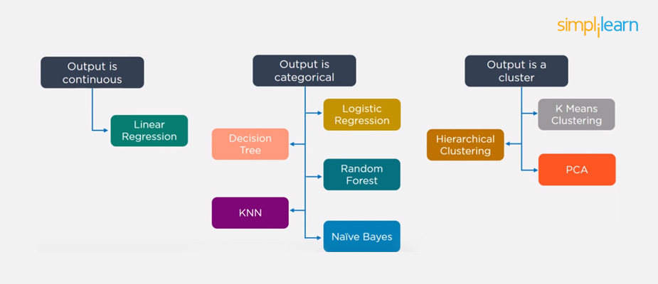

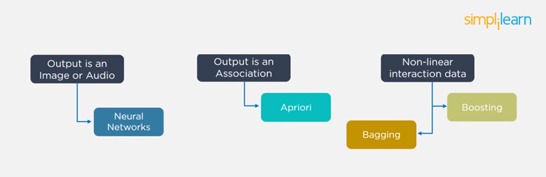


#### 27. Briefly Explain Logistic Regression.
Logistic regression is a classification algorithm used to predict a binary outcome for a given set of independent variables.

The output of logistic regression is either a 0 or 1 with a threshold value of generally 0.5. Any value above 0.5 is considered as 1, and any point below 0.5 is considered as 0.

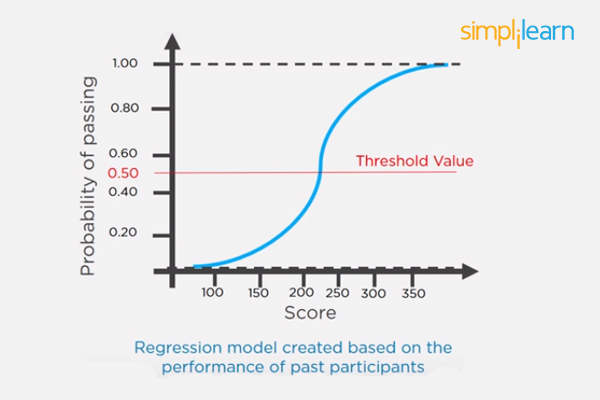


#### 28. What is a Recommendation System?
Anyone who has used Spotify or shopped at Amazon will recognize a recommendation system: It’s an information filtering system that predicts what a user might want to hear or see based on choice patterns provided by the user.
Example:
- Netflix - "Other Movies you might enjoy"
- Amazon - "Customers who bought X also bought Y."

Such systems are called `recommendation engines` or more broadly `recommender systems`.

They typically produce recommendations in one of two ways: using `collaborative` or `content-based filtering`:

- **Collaborative filtering** methods build a model based on **users past behavior** (items previously purchased, movies viewed and rated, etc) and use decisions made by current and other users. This model is then used to predict items (or ratings for items) that the user may be interested in.

-  **Content-based filtering** methods use **features of an item** to recommend additional items with similar properties. These approaches are often combined in Hybrid Recommender Systems.

Here is a comparison of these 2 approaches used in two popular music recommender systems - Last.fm and Pandora Radio. (example from Recommender System entry)
- **Last.fm** creates a "station" of recommended songs by observing what bands and individual tracks the user has listened to on a regular basis and comparing those against the listening behavior of other users. Last.fm will play tracks that do not appear in the user's library, but are often played by other users with similar interests. As this approach leverages the behavior of users, it is an example of a `collaborative filtering technique`.
- **Pandora** uses the properties of a song or artist (a subset of the 450 attributes provided by the [Music Genome Project](https://www.pandora.com/about/mgp)) in order to seed a "station" that plays music with similar properties. User feedback is used to refine the station's results, deemphasizing certain attributes when a user "dislikes" a particular song and emphasizing other attributes when a user "likes" a song. This is an example of a `content-based approach`.

More info from Wikipedia:


This image shows an example of predicting of the user's rating using collaborative filtering. At first, people rate different items (like videos, images, games). After that, the system is making predictions about user's rating for an item, which the user hasn't rated yet. These predictions are built upon the existing ratings of other users, who have similar ratings with the active user. For instance, in our case the system has made a prediction, that the active user won't like the video.

**Methodology**:
 - [Collaborative filtering](https://en.wikipedia.org/wiki/Collaborative_filtering): Collaborative filtering systems have many forms, but many common systems can be reduced to two steps:
  - Look for users who share the same rating patterns with the active user (the user whom the prediction is for).
  - Use the ratings from those like-minded users found in step 1 to calculate a prediction for the active user
  - This falls under the category of user-based collaborative filtering. A specific application of this is the user-based **K-NN** (K Nearest Neighbor algorithm).

 - [Content based filtering](https://en.wikipedia.org/wiki/Recommender_system#Content-based_filtering):  - Alternatively, **item-based collaborative filtering** (users who bought x also bought y), proceeds in an item-centric manner:
   - Build an item-item matrix determining relationships between pairs of items
   - Infer the tastes of the current user by examining the matrix and matching that user's data

More on Content based filtering:
Approach 1:
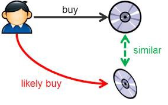
  - In model-building stage, the system first find the similarity between all pairs of items, then it uses the most similar items to a user’s already-rated items to generate a list of recommendations in recommendation stage.
 - For example, if someone watches Edge of Tomorrow, system may recommend Looper based on similarity .
  - *How can you find the similarity between items?*

  - Usually the similarity will be derived from the description of the item and the concept of **TF-IDF** will be introduced. Then each item will be represented by a TF-IDF vector - used to evaluate how important a word is to a document in a document corpus. The importance of the word increases proportionally to the number of times a word appears in the document but is offset by the frequency of the word in the corpus.
  - Since the method heavily relies on the description to distinguish each items, the description shall go deeper into the product details, i.e title, summary, taglines, genre, so that it provides much more information about the item.

Here is another approach to **Content Filtering**:
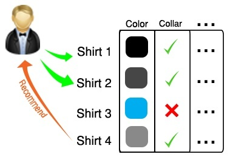

Approach 2 leverages description or attributes from items the user has interacted to recommend similar items. It depends only on the user previous choices, making this method robust to avoid the cold-start problem. For textual items, like articles, news and books, it is simple to use the article category or raw text to build item profiles and user profiles.

Pros/Cons Pros & Cons of both approaches

Approach 1
- Pros:
 - Unlike Collaborative Filtering, if the items have sufficient descriptions, we avoid the “new item problem”.
 - Content representations are varied and they open up the options to use different approaches like: text processing techniques, the use of semantic information, inferences, etc…
 - It is easy to make a more transparent system: we use the same content to explain the recommendations.
- Cons:
 - Content-Based RecSys tend to over-specialization: they will recommend items similar to those already consumed, with a tendency of creating a “filter bubble”.

Approach 2
- Pros
 - User independence: collaborative filtering needs other users’ rating to find the similarity between the users and then give the suggestion. Instead, content-based method only have to analyze the items and user profile for recommendation.
 - Transparency: collaborative method gives you the recommendation because some unknown users have the same taste like you, but content-based method can tell you they recommend you the items based on what features.
 - No cold start: opposite to collaborative filtering, new items can be suggested before being rated by a substantial number of users.
- Cons
 - Limited content analysis: if the content does not contain enough information to discriminate the items precisely, the recommendation will be not precisely at the end.
 - Over-specialization: content-based method provides a limit degree of novelty, since it has to match up the features of profile and items. A totally perfect content-based filtering may suggest nothing “surprised.”
 - New user: when there’s not enough information to build a solid profile for a user, the recommendation could not be provided correctly.


#### 29. What is Gradient Descent?
Gradient descent is an optimization algorithm that is used to find the coefficients of a function that minimizes the cost function. By trying different coefficient values, we can evaluate them and easily find the lowest cost.
It's based on a convex function and tweaks its parameters iteratively to minimize a given function to its local minimum. You start by defining the initial parameter's values and from there gradient descent uses calculus to iteratively adjust the values so they minimize the given cost-function.

What is Gradient? "A gradient measures how much the output of a function changes if you change the inputs a little bit." — Lex Fridman (MIT)"

A gradient simply measures the change in all weights with regard to the change in error. You can also think of a gradient as the slope of a function. The higher the gradient, the steeper the slope and the faster a model can learn. But if the slope is zero, the model stops learning. In mathematical terms, a gradient is a partial derivative with respect to its inputs.

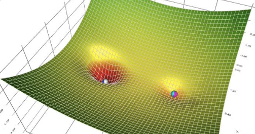


IMPORTANCE OF THE LEARNING RATE:

How big the steps are gradient descent takes into the direction of the local minimum are determined by the learning rate, which figures out how fast or slow we will move towards the optimal weights.

For gradient descent to reach the local minimum we must set the learning rate to an appropriate value, which is neither too low nor too high. This is important because if the steps it takes are too big, it may not reach the local minimum because it bounces back and forth between the convex function of gradient descent (see left image below). If we set the learning rate to a very small value, gradient descent will eventually reach the local minimum but that may take a while (see the right image).
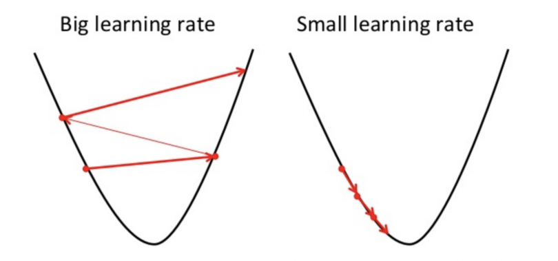

HOW TO MAKE SURE IT WORKS PROPERLY

A good way to make sure gradient descent runs properly is by plotting the cost function as the optimization runs. Put the number of iterations on the x-axis and the value of the cost-function on the y-axis. This helps you see the value of your cost function after each iteration of gradient descent, and provides a way to easily spot how appropriate your learning rate is. You can just try different values for it and plot them all together. The left image below shows such a plot, while the image on the right illustrates the difference between good and bad learning rates.
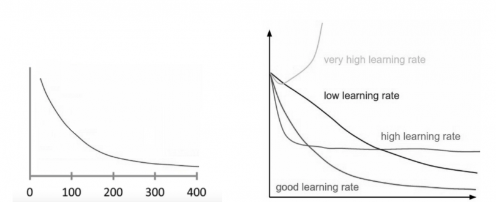
If gradient descent is working properly, the cost function should decrease after every iteration.
When gradient descent can’t decrease the cost-function anymore and remains more or less on the same level, it has converged.

TYPES OF GRADIENT DESCENT
There are three popular types of gradient descent that mainly differ in the amount of data they use:
- BATCH GRADIENT DESCENT: Batch gradient descent, also called vanilla gradient descent, calculates the error for each example within the training dataset, but only after all training examples have been evaluated does the model get updated. This whole process is like a cycle and it's called a `training epoch`.
Some advantages of batch gradient descent are its computational efficient, it produces a stable error gradient and a stable convergence. Some disadvantages are the stable error gradient can sometimes result in a state of convergence that isn’t the best the model can achieve. It also requires the entire training dataset be in memory and available to the algorithm.
- STOCHASTIC GRADIENT DESCENT
By contrast, stochastic gradient descent (SGD) does this for each training example within the dataset, meaning it updates the parameters for each training example one by one. Depending on the problem, this can make SGD faster than batch gradient descent. One advantage is the frequent updates allow us to have a pretty detailed rate of improvement. The frequent updates, however, are more computationally expensive than the batch gradient descent approach. Additionally, the frequency of those updates can result in noisy gradients, which may cause the error rate to jump around instead of slowly decreasing.
- MINI-BATCH GRADIENT DESCENT
Mini-batch gradient descent is the go-to method since it’s a combination of the concepts of SGD and batch gradient descent. It simply splits the training dataset into small batches and performs an update for each of those batches. This creates a balance between the robustness of stochastic gradient descent and the efficiency of batch gradient descent.


#### 30. Explain the difference between a Validation Set and a Test Set?
- A Validation Set is the data sample that is used to fine-tune the model’s hyperparameters
- A Test set involves data that is used for unbiased testing and evaluating the final performance of the model.

#### 31. What does P-value signify about the statistical data?
In a hypothesis test, `P-value` helps you determine the **significance of the results**, allowing you to either accept or reject the null hypothesis.
- A smaller p-value, i.e ≤ 0.05 means that you should reject the null hypothesis
- p-value > 0.05 means that you should not reject the null hypothesis
- p-value close to 0.05 means that it is marginal and could go either way.

#### 32. In NLP, What is stemming, tokenization, lemmarization and Part-of-speech-tagging?

- `Tokenization` is the process of breaking down the given text in natural language processing into the smallest unit in a sentence called a token.
For that, we can use `nltk (Natural Language Toolkit)` or other libraries like `TestBlob`

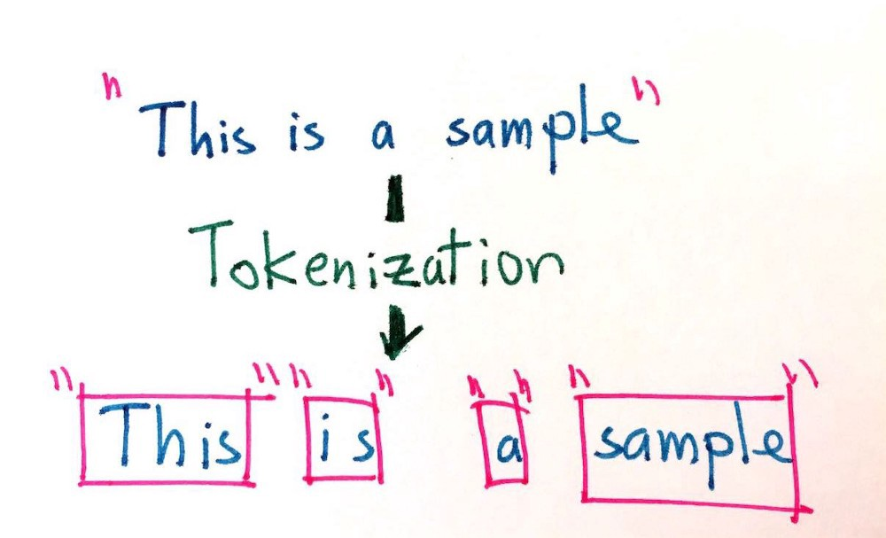

```python
import nltk
from nltk import sent_tokenize
from nltk import word_tokenize

text = "Hello everyone! Welcome to my blog post on Medium. We are studying Natural Language Processing."

tokens_sents = nltk.sent_tokenize(text)
print(tokens)
['Hello everyone!', 'Welcome to my blog post on Medium.', 'We are studying Natural Language Processing.']

tokens_words = nltk.word_tokenize(text)
print(tokens_words)
['Hello', 'everyone', '!', 'Welcome', 'to', 'my', 'blog', 'post', 'on', 'Medium', '.', 'We', 'are', 'studying', 'Natural', 'Language', 'Processing', '.']
```

- `Stemming`  is the process of finding the root of words.
- `Lemmatization` is the process of finding the form of the related word in the dictionary.

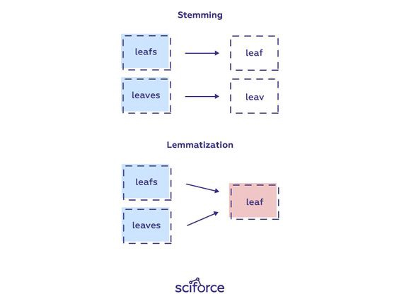

```python
from nltk.stem import PorterStemmer

ps = PorterStemmer()
word = ("civilization")
ps.stem(word)
'civil'
```

```python
from nltk.stem import WordNetLemmatizer
lemmatizer = WordNetLemmatizer()

# Lemmatize single word
print(lemmatizer.lemmatize("workers"))
print(lemmatizer.lemmatize("beeches"))
'worker'
'beech'
```

- `Part of Speech Tagging (POS-Tag)` is the labeling of the words in a text according to their word types (noun, adjective, adverb, verb, etc.).
POS tagging is a supervised learning solution that uses features like the previous word, next word, is first letter capitalized etc. NLTK has a function to get pos tags and it works after tokenization process.

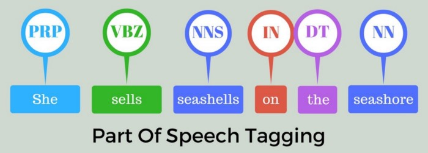

```python
import nltk
from nltk import word_tokenize

text = "The striped bats are hanging on their feet for best"
tokens = nltk.word_tokenize(text)
print("Parts of Speech: ",nltk.pos_tag(tokens))

Parts of Speech:  [('The', 'DT'), ('striped', 'JJ'), ('bats', 'NNS'), ('are', 'VBP'), ('hanging', 'VBG'), ('on', 'IN'), ('their', 'PRP$'), ('feet', 'NNS'), ('for', 'IN'), ('best', 'JJS')]
```
