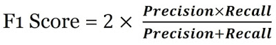

# Algorithms and Theory

On this section, the candidate will have to show an understanding of how algorithms compare with one another and how to measure their efficacy and accuracy in the right way.

#### 1. What Are the Different Types of Machine Learning and some example of algorithms?ml-types
There are three types of machine learning:

**Supervised Learning**
- In supervised machine learning, a model makes predictions or decisions based on past or `labeled data`. Labeled data refers to sets of data that are given tags or labels, and thus made more meaningful.
- Here the human experts acts as the teacher where we feed the computer with training data containing the input/predictors and we show it the correct answers (output) and from the data the computer should be able to learn the patterns.
- Supervised learning algorithms try to *model relationships and dependencies between the target prediction output and the input features* such that we can predict the output values for new data based on those relationships which it learned from the previous data sets.
- List of Common algorithms:
 - Nearest Neighbor
 - Naive Bayes
 - Decision Trees
 - Linear Regression
 - Support Vector Machines (SVM)
 - Neural Networks

**Unsupervised Learning**
- In unsupervised learning, we `don't have labeled data`. A model can identify patterns, anomalies, and relationships in the input data
- Here there’s no teacher at all, actually the computer might be able to teach you new things after it learns patterns in data, these algorithms a particularly useful in cases where the human expert doesn’t know what to look for in the data.
- are the family of machine learning algorithms which are mainly used in *pattern detection* and *descriptive modeling*. However, *there are no output categories or labels* here based on which the algorithm can try to model relationships. These algorithms try to use techniques on the input data to mine for rules, detect patterns, and summarize and group the data points which help in deriving meaningful insights and describe the data better to the users.
- List of Common algorithms:
 - k-means clustering
 - Association Rules

**Reinforcement Learning**
- Using reinforcement learning, the model can learn based on the rewards it received for its previous action.
- method aims at using observations gathered from the interaction with the environment to take actions that would maximize the reward or minimize the risk. Reinforcement learning algorithm (called the agent) continuously learns from the environment in an iterative fashion. In the process, the agent learns from its experiences of the environment until it explores the full range of possible states.
- Reinforcement Learning is a type of Machine Learning, and thereby also a branch of Artificial Intelligence. It allows machines and software agents to automatically determine the ideal behavior within a specific context, in order to maximize its performance. Simple reward feedback is required for the agent to learn its behavior; this is known as the reinforcement signal.
- List of Common Algorithms
 - Q-Learning
 - Temporal Difference (TD)
 - Deep Adversarial Networks

#### 2. How do you handle missing or corrupted data?
Handling the missing values is one of the greatest challenges faced by analysts, because making the right decision on how to handle it generates robust data models. Let us look at different ways of **imputing** the missing values.
- **1. Deleting Rows**: This method commonly used to handle the null values. Here, we either delete a particular row if it has a null value for a particular feature and a particular column if it has more than 70-75% of missing values. This method is advised only when there are enough samples in the data set. One has to make sure that after we have deleted the data, there is no addition of bias. Removing the data will lead to loss of information which will not give the expected results while predicting the output.
 - There are two useful methods in Pandas: `IsNull()` and `dropna()` will help to find the columns/rows with missing data and drop them
 - **Pros:**
 - Complete removal of data with missing values results in robust and highly accurate model
 - Deleting a particular row or a column with no specific information is better, since it does not have a high weightage
 - **Cons:**
 - Loss of information and data
 - Works poorly if the percentage of missing values is high (say 30%), compared to the whole dataset

- **2. Replacing With Mean/Median/Mode**: This strategy can be applied on a feature which has `numeric` data like the age of a person or the ticket fare. We can calculate the mean, median or mode of the feature and replace it with the missing values. This is an approximation which can add variance to the data set. But the loss of the data can be negated by this method which yields better results compared to removal of rows and columns. Replacing with the above three approximations are a statistical approach of handling the missing values. This method is also called as leaking the data while training. Another way is to approximate it with the deviation of neighbouring values. This works better if the data is linear.  
 - you can use `mean()` and `replace()`:
 
  - Or you can also use: `median()` or `mode()`
 
 - To replace it with median and mode we can use the following to calculate the same:
 - **Pros:**
 - This is a better approach when the data size is small
 - It can prevent data loss which results in removal of the rows and columns
 - **Cons:**
 - Imputing the approximations add variance and bias
 - Works poorly compared to other multiple-imputations method

 - **3. Assigning An Unique Category**:
A `categorical` feature will have a definite number of possibilities, such as gender, for example. Since they have a definite number of classes, we can assign another class for the missing values. Here, the features Cabin and Embarked have missing values which can be replaced with a new category, say, U for ‘unknown’. This strategy will add more information into the dataset which will result in the change of variance. Since they are categorical, we need to find one hot encoding to convert it to a numeric form for the algorithm to understand it.
 - You can use `fillna()` to fill in all `NaN` values with a value:
 
 - **Pros**:
 - Less possibilities with one extra category, resulting in low variance after one hot encoding — since it is categorical
 - Negates the loss of data by adding an unique category
 - **Cons**:
 - Adds less variance
 - Adds another feature to the model while encoding, which may result in poor performance

 - **4. Predicting The Missing Values**: Using the features which do not have missing values, we can `predict the nulls with the help of a machine learning algorithm`. This method may result in better accuracy, unless a missing value is expected to have a very high variance. We will be using linear regression to replace the nulls in the feature ‘age’, using other available features. One can experiment with different algorithms and check which gives the best accuracy instead of sticking to a single algorithm.
 
 - **Pros**:
 - Imputing the missing variable is an improvement as long as the bias from the same is smaller than the omitted variable bias
 - Yields unbiased estimates of the model parameters
 - **Cons**:
 - Bias also arises when an incomplete conditioning set is used for a categorical variable
 - Considered only as a proxy for the true values

-  **5. Using Algorithms Which Support Missing Values**
- `KNN` is a machine learning algorithm which works on the principle of distance measure. This algorithm can be used when there are nulls present in the dataset. While the algorithm is applied, KNN considers the missing values by taking the majority of the K nearest values. In this particular dataset, taking into account the person’s age, sex, class etc, we will assume that people having same data for the above mentioned features will have the same kind of fare.
 - Unfortunately, the SciKit Learn library for the K – Nearest Neighbour algorithm in Python does not support the presence of the missing values.
- Another algorithm which can be used here is `RandomForest`. This model produces a robust result because it works well on non-linear and the categorical data. It adapts to the data structure taking into consideration of the high variance or the bias, producing better results on large datasets.
- **Pros**:
- Does not require creation of a predictive model for each attribute with missing data in the dataset
- Correlation of the data is neglected
- **Cons**:
- Is a very time consuming process and it can be critical in data mining where large databases are being extracted
- Choice of distance functions can be Euclidean, Manhattan etc. which is do not yield a robust result

#### 3. What’s the trade-off between bias and variance?
- **Bias** is error due to erroneous or overly simplistic assumptions in the learning algorithm you’re using. This can lead to the model **underfitting** your data, making it **hard for it to have high predictive accuracy and for you to generalize** your knowledge from the training set to the test set.

- **Variance** is error due to too much complexity in the learning algorithm you’re using. This leads to the algorithm being highly sensitive to high degrees of variation in your training data, which can lead your model to **overfit** the data. You’ll be **carrying too much noise from your training data** for your model to be very useful for your test data.

The bias-variance decomposition essentially decomposes the learning error from any algorithm by adding the bias, the variance and a bit of irreducible error due to noise in the underlying dataset. Essentially, if you make the model more complex and add more variables, you’ll lose bias but gain some variance — in order to get the optimally reduced amount of error, you’ll have to tradeoff bias and variance.
**You don’t want either high bias or high variance in your model.**

#### 4. Confusion matrix
##### 4a. What is a Confusion matrix?

- It is a tool to determine the performance of a classifier. It contains information about actual and predicted classifications. The below table shows confusion matrix of two-class, spam and non-spam classifier.
- There are four outputs in confusion matrix:
- **True Positive (TP)**: the number of correct predictions that an example is positive which means positive class correctly identified as positive.
 - Example: Given class is spam and the classifier has been correctly predicted it as spam.      
- **False Negative (FN)**: the number of incorrect predictions that an example is negative which means positive class incorrectly identified as negative.
 - Example: Given class is spam however, the classifier has been incorrectly predicted it as non-spam.  
- **False positive (FP)**: the number of incorrect predictions that an example is positive which means negative class incorrectly identified as positive.
 - Example: Given class is non-spam however, the classifier has been incorrectly predicted it as spam.
- **True Negative (TN)**: the number of correct predictions that an example is negative which means negative class correctly identified as negative.
 - Example: Given class is spam and the classifier has been correctly predicted it as negative.
 

##### 4b. In a Confusion matrix, define precision, recall and F1 score.
- Both are Advanced classification metrics based on confusion matrix
- **Recall** (also known as **sensitivity**) is also known as the true positive rate: the amount of positives your model claims compared to the actual number of positives there are throughout the data.
- **Precision** is also known as the positive predictive value, and it is a measure of the amount of accurate positives your model claims compared to the number of positives it actually claims. It can be easier to think of recall and precision in the context of a case where you’ve predicted that there were 10 apples and 5 oranges in a case of 10 apples. You’d have perfect recall (there are actually 10 apples, and you predicted there would be 10) but 66.7% precision because out of the 15 events you predicted, only 10 (the apples) are correct.
- **F1 score**: weighted average of the recall (sensitivity) and precision. F1 score might be good choice when you seek to balance between Precision and Recall.

#### 5. What is Bayes’ Theorem? How is it useful in a machine learning context?
- Bayes’ Theorem gives you the posterior probability of an event given what is known as prior knowledge.
- Mathematically, it’s expressed as the true positive rate of a condition sample divided by the sum of the false positive rate of the population and the true positive rate of a condition.
 - Example: Say you had a 60% chance of actually having the flu after a flu test, but out of people who had the flu, the test will be false 50% of the time, and the overall population only has a 5% chance of having the flu. Would you actually have a 60% chance of having the flu after having a positive test?
 - Bayes’ Theorem says no. It says that you have a (.6 * 0.05) (True Positive Rate of a Condition Sample) / (.6 * 0.05)(True Positive Rate of a Condition Sample) + (.5 * 0.95) (False Positive Rate of a Population)  = 0.0594 or 5.94% chance of getting a flu.
- Bayes’ Theorem is the basis behind a branch of machine learning that most notably includes the Naive Bayes classifier. That’s something important to consider when you’re faced with machine learning interview questions.

##### 5b. What Is ‘naive’ in the Naive Bayes Classifier?
 - The classifier is called ‘naive’ because it makes assumptions that may or may not turn out to be correct.
 - The algorithm assumes that the presence of one feature of a class is not related to the presence of any other feature (absolute independence of features), given the class variable.
 - For instance, a fruit may be considered to be a cherry if it is red in color and round in shape, regardless of other features. This assumption may or may not be right (as an apple also matches the description).

#### 6. What’s your favorite algorithm, and can you explain it to me in less than a minute?
 - Interviewers ask such machine learning interview questions to test your understanding of how to communicate complex and technical nuances with poise and the ability to summarize quickly and efficiently. While answering such questions, make sure you have a choice and ensure you can explain different algorithms so simply and effectively that a five-year-old could grasp the basics!

#### 7. What’s the difference between Type I and Type II error?
 - Don’t think that this is a trick question! Many machine learning interview questions will be an attempt to lob basic questions at you just to make sure you’re on top of your game and you’ve prepared all of your bases.
 - **Type I** error is a `false positive`, while **Type II** error is a `false negative`.
 - Briefly stated, Type I error means claiming something has happened when it hasn’t, while Type II error means that you claim nothing is happening when in fact something is.
 - A clever way to think about this is to think of:
  - `Type I` error as telling a man he is pregnant
  - while `Type II` error means you tell a pregnant woman she isn’t carrying a baby.

#### 8. What Are the Three Stages of Building a Model in Machine Learning?
The three stages of building a machine learning model are:
 - Model Building: Choose a suitable algorithm for the model and train it according to the requirement
- Model Testing: Check the accuracy of the model through the test data
- Applying the Model: Make the required changes after testing and use the final model for real-time projects
Here, it’s important to remember that once in a while, the model needs to be checked to make sure it’s working correctly. It should be modified to make sure that it is up-to-date.

#### 9. Compare K-means and KNN Algorithms.
 - **K-Means**
  - K-Means is unsupervised
  - K-Means is a clustering algorithm
  - The points in each cluster are similar to each other, and each cluster is different from its neighboring clusters

 - **KNN**
  - KNN is supervised in nature
  - KNN is a classification algorithm
  - It classifies an unlabeled observation based on its K (can be any number) surrounding neighbors

#### 10. When Will You Use Classification over Regression?
- Classification is used when your target is categorical, while regression is used when your target variable is continuous. Both classification and regression belong to the category of supervised machine learning algorithms.
- Examples of classification problems include:
 - Predicting yes or no
 - Estimating gender
 - Breed of an animal
 - Type of color
- Examples of regression problems include:
 - Estimating sales and price of a product
 - Predicting the score of a team
 - Predicting the amount of rainfall

#### 11. How Do You Design an Email Spam Filter?
 - Building a spam filter involves the following process:
 - The email spam filter will be fed with thousands of emails
 - Each of these emails already has a label: ‘spam’ or ‘not spam.’
 - The supervised machine learning algorithm will then determine which type of emails are being marked as spam based on spam words like the lottery, free offer, no money, full refund, etc.
 - The next time an email is about to hit your inbox, the spam filter will use statistical analysis and algorithms like Decision Trees and SVM to determine how likely the email is spam
 - If the likelihood is high, it will label it as spam, and the email won’t hit your inbox
 - Based on the accuracy of each model, we will use the algorithm with the highest accuracy after testing all the models

#### 12. What is a Random Forest?
- A ‘random forest’ is a supervised machine learning algorithm that is generally used for classification problems. It operates by constructing multiple decision trees during the training phase. The random forest chooses the decision of the majority of the trees as the final decision.

