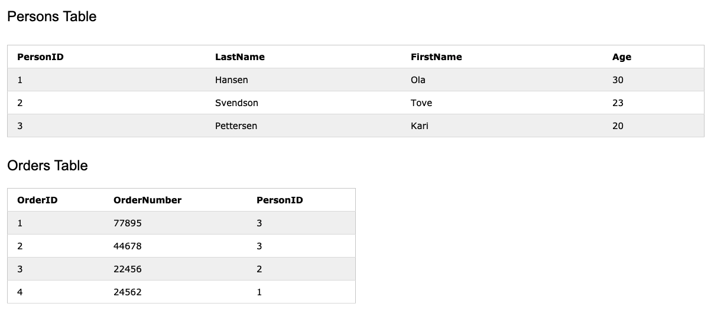
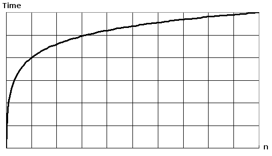

# Programming - General


#### Do you have experience with Spark or big data tools for machine learning?
 - You’ll want to get familiar with the meaning of big data for different companies and the different tools they’ll want. Spark is the big data tool most in demand now, able to handle immense datasets with speed. Be honest if you don’t have experience with the tools demanded, but also take a look at job descriptions and see what tools pop up: you’ll want to invest in familiarizing yourself with them.


#### How do you handle missing or corrupted data in a dataset?
You could find missing/corrupted data in a dataset and either drop those rows or columns, or decide to replace them with another value.

In Pandas, there are two very useful methods: `isnull()` and `dropna()` that will help you find columns of data with missing or corrupted data and drop those values. If you want to fill the invalid values with a placeholder value (for example, 0), you could use the `fillna()` method.

#### What are some differences between a linked list and an array?
 - An **array** is an ordered collection of objects.
 - A **linked list** is a series of objects with pointers that direct how to process them sequentially.
 - An array assumes that every element has the same size, unlike the linked list.
 - A linked list can more easily grow organically: an array has to be pre-defined or re-defined for organic growth. Shuffling a linked list involves changing which points direct where—meanwhile, shuffling an array is more complex and takes more memory.


#### Describe a hash table.
 - A hash table is a data structure that produces an associative array. A key is mapped to certain values through the use of a hash function. They are often used for tasks such as database indexing.
 - A hash table is a data structure that is used to store keys/value pairs. It uses a hash function to compute an index into an array in which an element will be inserted or searched. By using a good hash function, hashing can work well. Under reasonable assumptions, the average time required to search for an element in a hash table is O(1).

Let us consider string S. You are required to count the frequency of all the characters in this string.

#### Which data visualization libraries do you use? What are your thoughts on the best data visualization tools?
 - What’s important here is to define your views on how to properly visualize data and your personal preferences when it comes to tools. Popular tools include R’s ggplot, Python’s seaborn and matplotlib, and tools such as Plot.ly and Tableau.

#### How are primary and foreign keys related in SQL?
 - A `primary key` is used to ensure data in the specific column(s) is unique.
  - It uniquely identifies a record in the relational database table.
  - Only one primary key is allowed in a table
  - It is a combination of `UNIQUE` and `Not Null` constraints

 - A `foreign key` is a column or group of columns in a relational database table that provides a link between data in two tables.
  - It refers to the field in a table which is the primary key of another table
  - more than one foreign key are allowed in a table.
  - It can contain duplicate values and a table in a relational database.
  - It can also contain NULL values.

The table with the foreign key is called the child table, and the table with the primary key is called the referenced or parent table.
The FOREIGN KEY constraint is used to prevent actions that would destroy links between tables.


Example:


- The "PersonID" column in the "Persons" table is the `PRIMARY KEY` in the "Persons" table.
- The "PersonID" column in the "Orders" table is a `FOREIGN KEY` in the "Orders" table.
- The `FOREIGN KEY` constraint prevents invalid data from being inserted into the foreign key column, because it has to be one of the values contained in the parent table.

Example of SQL for MySQL:
```SQL
CREATE TABLE Orders (
    OrderID int NOT NULL,
    OrderNumber int NOT NULL,
    PersonID int,
    PRIMARY KEY (OrderID),
    FOREIGN KEY (PersonID) REFERENCES Persons(PersonID)
);
```


#### What is the difference between a JOIN and UNION in SQL?
 - JOIN combines data from many tables based on a matched condition between them.
  - It combines data into new columns.
  - Number of columns selected from each table may not be same.
  - Datatypes of corresponding columns selected from each table can be different.

 - SQL combines the result-set of two or more SELECT statements.
  - It combines data into new rows
  - Number of columns selected from each table should be same.
  - Datatypes of corresponding columns selected from each table should be same.

```SQL
SELECT columnlist
FROM   maintable
       INNER JOIN
       secondtable ON join condition
```

```SQL
SELECT columnlist
FROM   table1
UNION
SELECT columnlist
FROM   table2
```

#### How would you build a data pipeline?
 - Data pipelines are the bread and butter of machine learning engineers, who take data science models and find ways to automate and scale them. Make sure you’re familiar with the tools to build data pipelines (such as Apache Airflow) and the platforms where you can host models and pipelines (such as Google Cloud or AWS or Azure). Explain the steps required in a functioning data pipeline and talk through your actual experience building and scaling them in production.

[Example with Apache Airflow](https://towardsdatascience.com/10-minutes-to-building-a-machine-learning-pipeline-with-apache-airflow-53cd09268977)

[Hidden Technical Debt in ML Systems (White Paper)](https://papers.nips.cc/paper/2015/file/86df7dcfd896fcaf2674f757a2463eba-Paper.pdf)

#### What is the Big O notation
In computer science, big O notation is used to classify algorithms according to how their run time or space requirements grow as the input size grows
Examples:
- `O(1)` - constant / Ex: Determining if a binary number is even or odd; Calculating (-1)^{n}; Using a constant-size lookup table
- `O(n)` - linear / Ex: Finding an item in an unsorted list or in an unsorted array


##### What does it mean if an operation is O(log n)?  
 - `O(log n)` means for every element, you're doing something that only needs to look at log N of the elements. This is usually because you know something about the elements that let you make an efficient choice (for example to reduce a search space). Big



##### Why do we use Big O notation to compare algorithms?   
The fact is it's difficult to determine the exact runtime of an algorithm. It depends on the speed of the computer processor. So instead of talking about the runtime directly, we use Big O Notation to talk about **how quickly the runtime grows depending on input size**.

With Big O Notation, we use the size of the input, which we call `n`. So we can say things like the runtime grows ``“on the order of the size of the input” (O(n))`` or ``“on the order of the square of the size of the input” (O(n2))``. Our algorithm may have steps that seem expensive when n is small but are eclipsed eventually by other steps as n gets larger. For Big O Notation analysis, we care more about the stuff that grows fastest as the input grows, because everything else is quickly eclipsed as n gets very large.


#### What Packages in the Standard Library, Useful for Data Science Work, Do You Know (in python)?
The following packages in the Python Standard Library are very handy for data science projects:

- `NumPy`:
 - NumPy (or Numerical Python) is one of the principle packages for data science applications. It’s often used to process large multidimensional arrays, extensive collections of high-level mathematical functions, and matrices. Implementation methods also make it easy to conduct multiple operations with these objects.

 - There have been many improvements made over the last year that have resolved several bugs and compatibility issues. NumPy is popular because it can be used as a highly efficient multi-dimensional container of generic data. It’s also an excellent library as it makes data analysis simple by processing data faster while using a lot less code than lists.

- `Pandas`:
 - Pandas is a Python library that provides highly flexible and powerful tools and high-level data structures for analysis. Pandas is an excellent tool for data analytics because it can translate highly complex operations with data into just one or two commands.

 - Pandas comes with a variety of built-in methods for combining, filtering, and grouping data. It also boasts time-series functionality that is closely followed by remarkable speed indicators.

- `SciPy`:
 - SciPy is another outstanding library for scientific computing. It’s based on NumPy and was created to extend its capabilities. Like NumPy, SciPy’s data structure is also a multidimensional array that’s implemented by NumPy.

 - The SciPy package contains powerful tools that help solve tasks related to integral calculus, linear algebra, probability theory, and much more.

 - Recently, this Python library went through some major build improvements in the form of continuous integration into multiple operating systems, methods, and new functions. Optimizers were also updated, and several new BLAS and LAPACK functions were wrapped.
