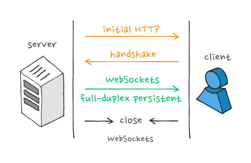

# System Design Interview
The technical portion of the interview is more for assessing the System Architecture experience of a candidate.
We will be expecting you to visualize the candidate's thoughts and design on the whiteboard with block diagrams and rough outlines of some class definitions and API contracts.

### Framework to help the candidate through the design
The candidate should follow some of the below steps (recommended) but does not have to - end goal is for the candidate to present a system architecture/design that meets the needs/rqts, and more importantly, can mature it as we add more constraints (scalability, resiliency, security, ...)

1. Pb statement of the platform/tool/product that needs to be built
- What is it, who is the target audience,...
- Let the candidate asks for clarifying Questions

2. Requirements and Goals of the system
- Functional Requirements
- Non-Functional Requirements
- Extended Requirements

3. Capacity Estimation and Constraints
- Storage Estimation (per day, for 5 years)
- Bandwith Estimation for ingress/egress (per second)

4. High Level Design
- This is where the candidate provides a high level system arch design of the key components required to meet the requirements and some data/traffic flow in between, and a high level set of API contracts
- System APIs
- DataBase design

5. Detailed Component Design
This is where we dive deeper into each block/component/service

6. Non Functional Reqts Design considerations
This is where we want the candidate to identify potential bottlenecks and how to resolve them and what are the tradeoffs
- Data Partitioning and Replication
- Cache
- Data Consistency (for syncing across devices)
- Load balancing
- Fault tolerance
- Monitoring
- Analytics

### System Design Open Questions

- Describe a system / product / app you or your team built.

- How did you evaluate the design of your system?

- How did you test performance and scalability?

- Did you have to iterate on the design?

- Looking back, what would you have done differently?

### System Design Specific Questions
#### What is an in-memory datastore and when would you use it? What technologies exist?

From [AWS](https://aws.amazon.com/nosql/in-memory/): An in-memory database is a type of purpose-built database that relies primarily on memory for data storage, in contrast to databases that store data on disk or SSDs. In-memory databases are designed to attain minimal response time by eliminating the need to access disks. Because all data is stored and managed exclusively in main memory, it is at risk of being lost upon a process or server failure. In-memory databases can persist data on disks by storing each operation in a log or by taking snapshots.

In-memory databases are ideal for applications that require microsecond response times and can have large spikes in traffic coming at any time such as gaming leaderboards, session stores, and real-time analytics.

Use cases
- **Real-time bidding**: Real-time bidding refers to the buying and selling of online ad impressions. Usually the bid has to be made while the user is loading a webpage, in 100-120 milliseconds and sometimes as little as 50 milliseconds. During this time period, real-time bidding applications request bids from all buyers for the ad spot, select a winning bid based on multiple criteria, display the bid, and collect post ad-display information. In-memory databases are ideal choices for ingesting, processing, and analyzing real-time data with submillisecond latency.  

- **Gaming leaderboards**: A relative gaming leaderboard shows a gamer's position relative to other players of a similar rank. A relative gaming leaderboard can help to build engagement among players and meanwhile keep gamers from becoming demotivated when compared only to top players. For a game with millions of players, in-memory databases can deliver sorting results quickly and keep the leaderboard updated in real time.

- **Caching**: A cache is a high-speed data storage layer which stores a subset of data, typically transient in nature, so that future requests for that data are served up faster than is possible by accessing the data’s primary storage location. Caching allows you to efficiently reuse previously retrieved or computed data. The data in a cache is generally stored in fast access hardware such as RAM (Random-access memory) and may also be used in correlation with a software component. A cache's primary purpose is to increase data retrieval performance by reducing the need to access the underlying slower storage layer.

In-memory databases on AWS
- **Amazon Elasticache for Redis**: Amazon ElastiCache for Redis is a blazing fast in-memory data store that provides submillisecond latency to power internet-scale, real-time applications. Developers can use ElastiCache for Redis as an in-memory nonrelational database. The ElastiCache for Redis cluster configuration supports up to 15 shards and enables customers to run Redis workloads with up to 6.1 TB of in-memory capacity in a single cluster. ElastiCache for Redis also provides the ability to add and remove shards from a running cluster. You can dynamically scale out and even scale in your Redis cluster workloads to adapt to changes in demand.

- **Amazon ElastiCache for Memcached**: Amazon ElastiCache for Memcached is a Memcached-compatible in-memory key-value store service that can be used as a cache or a data store. It delivers the performance, ease-of-use, and simplicity of Memcached. ElastiCache for Memcached is fully managed, scalable, and secure - making it an ideal candidate for use cases where frequently accessed data must be in-memory. It is a popular choice for use cases such as Web, Mobile Apps, Gaming, Ad-Tech, and E-Commerce.

Choosing between Redis and Memcached
Redis and Memcached are popular, open-source, in-memory data stores. Although they are both easy to use and offer high performance, there are important differences to consider when choosing an engine.
- **Memcached** is designed for simplicity while **Redis** offers a rich set of features that make it effective for a wide range of use cases. Understand your requirements and what each engine offers to decide which solution better meets your needs.
- **Memcached** is multithreaded but Redis is not. Memcached can make use of multiple processing cores. This means that you can handle more operations by scaling up compute capacity.
- **Redis** lets you create multiple replicas of a Redis primary. This allows you to scale database reads and to have highly available clusters. Memcached does not.
- **Redis** supports transactions which let you execute a group of commands as an isolated and atomic operation. Memcached does not.
- **Redis** also supports Pub/Sub messaging with pattern matching which you can use for high performance chat rooms, real-time comment streams, social media feeds, and server intercommunication.
- **Redis** has purpose-built commands for working with real-time geospatial data at scale. You can perform operations like finding the distance between two elements (for example people or places) and finding all elements within a given distance of a point.

#### What are the differences between SOAP and REST APIs
- SOAP stands for Simple Object Access Protocol whereas REST stands for Representational State Transfer.
- SOAP is a protocol whereas REST is an architectural pattern.
- SOAP uses service interfaces to expose its functionality to client applications while REST uses Uniform Service locators to access to the components on the hardware device.  
- SOAP was designed with a specification. It includes a WSDL file which has the required information on what the web service does in addition to the location of the web service.
- SOAP needs more bandwidth for its usage whereas REST doesn’t need much bandwidth.
- Comparing SOAP vs REST API, SOAP only works with XML formats whereas REST work with plain text, XML, HTML and JSON.
- SOAP cannot make use of REST whereas REST can make use of SOAP.

#### What is Base64?
Base64 is a group of binary-to-text encoding schemes that represent binary data in an ASCII string format by translating it into a radix-64 representation.
Base64 encoding schemes are commonly used when there is a need to encode binary data that needs to be stored and transferred over media that are designed to deal with ASCII. This is to ensure that the data remain intact without modification during transport. Base64 is commonly used in a number of applications including email via MIME, and storing complex data in XML.

One common application of base64 encoding on the web is to encode binary data  so it can be included in a `data: URL`.
Examples:
- `data:,Hello%2C%20World%21`
The text/plain data Hello, World!. Note how the comma is percent-encoded as %2C, and the space character as %20.
- `data:text/plain;base64,SGVsbG8sIFdvcmxkIQ==`
base64-encoded version of the above
- `data:text/html,%3Ch1%3EHello%2C%20World%21%3C%2Fh1%3E`
An HTML document with `<h1>Hello, World!</h1>`

Encoded size increase:

Each Base64 digit represents exactly 6 bits of data. So, three 8-bits bytes of the input string/binary file (3×8 bits = 24 bits) can be represented by four 6-bit Base64 digits (4×6 = 24 bits).

This means that the Base64 version of a string or file will be at most 133% the size of its source (a ~33% increase). The increase may be larger if the encoded data is small. For example, the string "a" with length === 1 gets encoded to "YQ==" with length === 4 — a 300% increase.

#### What is MD5?
The MD5 message-digest algorithm is a widely used hash function producing a 128-bit hash value. Although MD5 was initially designed to be used as a cryptographic hash function, it has been found to suffer from extensive vulnerabilities. It can still be used as a checksum to verify data integrity, but only against unintentional corruption. It remains suitable for other non-cryptographic purposes, for example for determining the partition for a particular key in a partitioned database.
One basic requirement of any cryptographic hash function is that it should be computationally infeasible to find two distinct messages that hash to the same value. MD5 fails this requirement catastrophically; such collisions can be found in seconds on an ordinary home computer.

### Webserver and HTTP questions
#### How many connections can a webserver handle?
A modern server can probably handle 50k concurrent connections at any time (or more).
On the TCP level the tuple (source ip, source port, destination ip, destination port) must be unique for each simultaneous connection. That means a single client cannot open more than 65535 simultaneous connections to a single server. But a server can (theoretically) serve 65535 simultaneous connections per client.

So in practice the server is only limited by how much CPU power, memory etc. it has to serve requests, not by the number of TCP connections to the server.

Note that HTTP doesn't typically keep TCP connections open for any longer than it takes to transmit the page to the client; and it usually takes much more time for the user to read a web page than it takes to download the page... while the user is viewing the page, he adds no load to the server at all.

So the number of people that can be simultaneously viewing your web site is much larger than the number of TCP connections that it can simultaneously serve.

#### What is Long Polling
`Long polling` is a more efficient form of the original polling technique. Making repeated requests to a server wastes resources, as each new incoming connection must be established, the HTTP headers must be parsed, a query for new data must be performed, and a response (usually with no new data to offer) must be generated and delivered. The connection must then be closed, and any resources clean
ed up. Rather than having to repeat this process multiple times for every client until new data for a given client becomes available, long polling is a technique where the server elects to hold a client’s connection open for as long as possible, delivering a response only after data becomes available or a timeout threshold has been reached.

Implementation is mostly a server-side concern. On the client side, only a single request to the server needs to be managed. When the response is received, the client can initiate a new request, repeating this process as many times as is necessary. The only difference to basic polling, as far as the client is concerned, is that a client performing basic polling may deliberately leave a small time window between each request so as to reduce its load on the server, and it may respond to timeouts with different assumptions than it would for a server that does not support long polling. With long polling, the client may be configured to allow for a longer timeout period (via a `Keep-Alive` header) when listening for a response – something that would usually be avoided seeing as the timeout period is generally used to indicate problems communicating with the server.

Apart from these concerns, there is little else that a client needs to do that would be different than if it were engaging in basic polling. By contrast, the server needs to manage the unresolved state of multiple connections, and it may need to implement strategies for preserving session state when multiple servers and load balancers are in use (commonly referred to as session “stickiness”). It also needs to gracefully handle connection timeout issues, which are much more likely to occur than with designed-for-purpose protocols such as `WebSockets`, a standard which did not arrive until years after long polling was established as a conventional technique for pseudo-realtime communication.

Considerations when using long polling
As long polling is really just an improvisation applied to an underlying request-response mechanism, it comes with an additional degree of complexity in its implementation. There are various concerns you’ll need to account for when considering the design of your system’s architecture.

- Message ordering and delivery guarantees
Reliable message ordering can be an issue with long polling because it's possible for multiple HTTP requests from the same client to be in flight simultaneously. For example, if a client has two browser tabs open consuming the same server resource, and the client-side application is persisting data to a local store such as localStorage or IndexedDb, there is no in-built guarantee that duplicate data won’t be written more than once. This could also happen if the client implementation uses more than one connection at a time, whether deliberately or as a result of a bug in the code.
- Another issue is that a server may send a response, but network or browser issues may prevent the message from being successfully received. Unless some sort of message receipt confirmation process is implemented, a subsequent call to the server may result in missed messages.
- Depending on the server implementation, confirmation of message receipt by one client instance may also cause another client instance to never receive an expected message at all, as the server could mistakenly believe that the client has already received the data it is expecting.

All of these concerns, and more need to be considered when implementing robust support for long polling in any realtime messaging system.

- Performance and scaling
Unfortunately, such complexity is difficult to scale effectively. To maintain the session state for a given client, that state must either be shareable among all servers behind a load balancer – a task with significant architectural complexity – or subsequent client requests within the same session must be routed to the same server to which their original request was processed. This form of deterministic “sticky” routing is problematic by design, especially when routing is performed on the basis of IP address, as it can place undue load on a single server in a cluster while leaving other servers mostly idle instead of spreading the load around efficiently. This can also become a potential denial-of-service attack vector – a problem which then requires further layers of infrastructure to mitigate that might otherwise have been unnecessary.

- Device support and fallbacks
In modern times (2018 at the time of this article), long polling can be less relevant for web application development given the widespread availability of real-time communication standards such as `WebSockets` and `WebRTC`. That said, there are cases where proxies and routers on certain networks will block WebSocket and WebRTC connections, or where network connectivity can make long-lived connection protocols such as these less practical. Besides, for certain client demographics, there may still be numerous devices and clients in use that lack support for newer standards. For these, long polling can serve as a good fail-safe fallback to ensure support for everyone, irrespective of their situation.

#### What is the difference between web socket and Long Polling?
`Long polling` is essentially a more efficient form of the original polling technique. Making repeated requests to a server wastes resources, as each new incoming connection must be established, the HTTP headers must be parsed, a query for new data must be performed, and a response (usually with no new data to offer) must be generated and delivered. The connection must then be closed and any resources cleaned up. Rather than having to repeat this process multiple times for every client until new data for a given client becomes available, long polling is a technique where the server elects to hold a client’s connection open for as long as possible, delivering a response only after data becomes available or a timeout threshold is reached.

`WebSockets` are a thin transport layer built on top of a device’s TCP/IP stack. The intent is to provide what is essentially an as-close-to-raw-as-possible TCP communication layer to web application developers while adding a few abstractions to eliminate certain friction that would otherwise exist concerning the way the web works. They also cater to the fact that the web has additional security considerations that must be taken into account to protect both consumers and service providers.

**Long Polling: pros and cons**
- Pros
 - Long polling is implemented on the back of XMLHttpRequest, which is near-universally supported by devices so there’s usually little need to support further fallback layers. In cases where exceptions must be handled though, or where a server can be queried for new data but does not support long polling (let alone other more modern technology standards), basic polling can sometimes still be of limited use, and can be implemented using XMLHttpRequest, or via JSONP through simple HTML script tags.

- Cons
 - Long polling is a lot more intensive on the server.
 - Reliable message ordering can be an issue with long polling because it is possible for multiple HTTP requests from the same client to be in flight simultaneously. For example, if a client has two browser tabs open consuming the same server resource, and the client-side application is persisting data to a local store such as localStorage or IndexedDb, there is no in-built guarantee that duplicate data won’t be written more than once.
 - Depending on the server implementation, confirmation of message receipt by one client instance may also cause another client instance to never receive an expected message at all, as the server could mistakenly believe that the client has already received the data it is expecting.

**WebSockets: pros and cons**
- Pros
 - WebSockets keeps a unique connection open while eliminating latency problems that arise with Long Polling.
 - WebSockets generally do not use XMLHttpRequest, and as such, headers are not sent every-time we need to get more information from the server. This, in turn, reduces the expensive data loads being sent to the server.
- Cons
 - WebSockets don’t automatically recover when connections are terminated – this is something you need to implement yourself, and is part of the reason why there are many client-side libraries in existence.
 - Browsers older than 2011 aren’t able to support WebSocket connections - but this is increasingly less relevant.

**Why the WebSocket protocol is the better choice**
Generally, WebSockets will be the better choice.

Long polling is much more resource intensive on servers whereas WebSockets have an extremely lightweight footprint on servers. Long polling also requires many hops between servers and devices. And these gateways often have different ideas of how long a typical connection is allowed to stay open. If it stays open too long something may kill it, maybe even when it was doing something important.

Why you should build with WebSockets:

Full-duplex asynchronous messaging. In other words, both the client and the server can stream messages to each other independently.
WebSockets pass through most firewalls without any reconfiguration.
Good security model (origin-based security model).

### DataBase questions

#### What are the `ACID` properties?

In database systems, ACID (Atomicity, Consistency, Isolation, Durability) refers to a standard set of properties that guarantee database transactions are processed reliably.

ACID is especially concerned with how a database recovers from any failure that might occur while processing a transaction.

An ACID-compliant DBMS ensures that the data in the database remains accurate and consistent despite any such failures.

ACID Definition
- Atomicity: it means that you guarantee that either all of the transaction succeeds or none of it does. You don’t get part of it succeeding and part of it not. If one part of the transaction fails, the whole transaction fails. With atomicity, it’s either “all or nothing”.

- Consistency: this ensures that you guarantee that all data will be consistent. All data will be valid according to all defined rules, including any constraints, cascades, and triggers that have been applied on the database.

- Isolation: Guarantees that all transactions will occur in isolation. No transaction will be affected by any other transaction. So a transaction cannot read data from any other transaction that has not yet completed.

- Durability: means that, once a transaction is committed, it will remain in the system – even if there’s a system crash immediately following the transaction. Any changes from the transaction must be stored permanently. If the system tells the user that the transaction has succeeded, the transaction must have, in fact, succeeded.

**When is ACID Needed?**
The ACID properties are designed as principles of transaction-oriented database recovery.

So ACID provides the principles that database transactions should adhere to, to ensure that data doesn’t become corrupt as a result of a failure of some sort.

A transaction is a single logical operation that may consist of one or many steps. For example, transferring money between bank accounts (i.e. debiting one account and crediting the other) is a transaction.

If a transaction like this fails halfway through, it could have major consequences. Money could be debited from the first account but not credited to the other account.

This is where the ACID principles should apply.

According to the ACID definition, a database is consistent if and only if it contains the results of successful transactions. Any database that is ACID-compliant will ensure that only successful transactions are processed. If a failure occurs before a transaction completes, no data will be changed.

So ACID-compliant DBMSs provide organisations with the confidence that their database will maintain data integrity, even if some type of failure occurs while transactions are in the middle of being processed.

#### Do No SQL DB support ACID properties?
 NoSQL data stores do not support ACID properties in favor of scalability and performance.

#### What is the difference between SQL and NoSQL?
Relational databases are structured and have predefined schemas like phone books that store phone numbers and addresses. Non-relational databases are unstructured, distributed, and have a dynamic schema like file folders that hold everything from a person’s address and phone number to their Facebook ‘likes’ and online shopping preferences.
 - SQL: Relational databases store data in rows and columns. Each row contains all the information about one entity and each column contains all the separate data points. Some of the most popular relational databases are MySQL, Oracle, MS SQL Server, SQLite, Postgres, and MariaDB.

 - NoSQL: Following are the most common types of NoSQL:
  - Key-Value Stores: Data is stored in an array of key-value pairs. The ‘key’ is an attribute name which is linked to a ‘value’. Well-known key-value stores include Redis, Voldemort, and Dynamo.
  - Document Databases: In these databases, data is stored in documents (instead of rows and columns in a table) and these documents are grouped together in collections. Each document can have an entirely different structure. Document databases include the CouchDB and MongoDB.
  - Wide-Column Databases: Instead of ‘tables,’ in columnar databases we have column families, which are containers for rows. Unlike relational databases, we don’t need to know all the columns up front and each row doesn’t have to have the same number of columns. Columnar databases are best suited for analyzing large datasets - big names include Cassandra and HBase.
  - Graph Databases: These databases are used to store data whose relations are best represented in a graph. Data is saved in graph structures with nodes (entities), properties (information about the entities), and lines (connections between the entities). Examples of graph database include Neo4J and InfiniteGraph.

#### When would you use SQL vs NoSQL?
**Reasons to use SQL database #**
Here are a few reasons to choose a SQL database:

- We need to ensure ACID compliance. ACID compliance reduces anomalies and protects the integrity of your database by prescribing exactly how transactions interact with the database. Generally, NoSQL databases sacrifice ACID compliance for scalability and processing speed, but for many e-commerce and financial applications, an ACID-compliant database remains the preferred option.
- Your data is structured and unchanging. If your business is not experiencing massive growth that would require more servers and if you’re only working with data that is consistent, then there may be no reason to use a system designed to support a variety of data types and high traffic volume.

**Reasons to use NoSQL database #**
When all the other components of our application are fast and seamless, NoSQL databases prevent data from being the bottleneck. Big data is contributing to a large success for NoSQL databases, mainly because it handles data differently than the traditional relational databases. A few popular examples of NoSQL databases are MongoDB, CouchDB, Cassandra, and HBase.

- Storing large volumes of data that often have little to no structure. A NoSQL database sets no limits on the types of data we can store together and allows us to add new types as the need changes. With document-based databases, you can store data in one place without having to define what “types” of data those are in advance.
- Making the most of cloud computing and storage. Cloud-based storage is an excellent cost-saving solution but requires data to be easily spread across multiple servers to scale up. Using commodity (affordable, smaller) hardware on-site or in the cloud saves you the hassle of additional software and NoSQL databases like Cassandra are designed to be scaled across multiple data centers out of the box, without a lot of headaches.
- Rapid development. NoSQL is extremely useful for rapid development as it doesn’t need to be prepped ahead of time. If you’re working on quick iterations of your system which require making frequent updates to the data structure without a lot of downtime between versions, a relational database will slow you down.

#### What are `Wide Column Stores`?
`Wide column stores`, also called extensible record stores, store data in records with an ability to hold very large numbers of dynamic columns.

Since the column names as well as the record keys are not fixed, and since a record can have billions of columns, wide column stores can be seen as `two-dimensional key-value stores`.

Wide column stores share the characteristic of being schema-free with document stores, however the implementation is very different.
Wide column stores must not be confused with the column oriented storage in some relational systems. This is an internal concept for improving the performance of an RDBMS for OLAP workloads and stores the data of a table not record after record but column by column.
Most popular examples
- Cassandra
- HBase
- Microsoft Azure Cosmos DB
- Google BigTable - It is not a relational database and can be better defined as a sparse, distributed multi-dimensional sorted map

#### What DB alternatives to SQL and NoSQL exist for a high number of small reads and writes?
We cannot use RDBMS like MySQL or NoSQL like MongoDB because we cannot afford to read/write a row from the database facing large bursts. This will not only make the basic operations of our service run with high latency but also create a huge load on databases.

Both of our requirements can be easily met with a wide-column database solution like `HBase`. HBase is a `column-oriented key-value NoSQL` database that can store multiple values against one key into multiple columns. HBase is modeled after Google’s BigTable and runs on top of Hadoop Distributed File System (HDFS). HBase groups data together to store new data in a memory buffer and, once the buffer is full, it dumps the data to the disk. This way of storage not only helps to store a lot of small data quickly but also fetching rows by the key or scanning ranges of rows. HBase is also an efficient database to store variable-sized data, which is also required by our service.

Another Wide column data store is `Cassandra`
If you need a Relational DB, you can also use `Vertica`

#### What is the CAP Theorem?
CAP theorem states that it is impossible for a distributed software system to simultaneously provide more than two out of three of the following guarantees (CAP): Consistency, Availability, and Partition tolerance. When we design a distributed system, trading off among CAP is almost the first thing we want to consider. CAP theorem says while designing a distributed system, we can pick only two of the following three options:

- Consistency: All nodes see the same data at the same time. Consistency is achieved by updating several nodes before allowing further reads.

- Availability: Every request gets a response on success/failure. Availability is achieved by replicating the data across different servers.

- Partition tolerance: The system continues to work despite message loss or partial failure. A partition-tolerant system can sustain any amount of network failure that doesn’t result in a failure of the entire network. Data is sufficiently replicated across combinations of nodes and networks to keep the system up through intermittent outages.

We cannot build a general data store that is continually available, sequentially consistent, and tolerant to any partition failures. We can only build a system that has any two of these three properties. Because, to be consistent, all nodes should see the same set of updates in the same order. But if the network loses a partition, updates in one partition might not make it to the other partitions before a client reads from the out-of-date partition after having read from the up-to-date one. The only thing that can be done to cope with this possibility is to stop serving requests from the out-of-date partition, but then the service is no longer 100% available.
